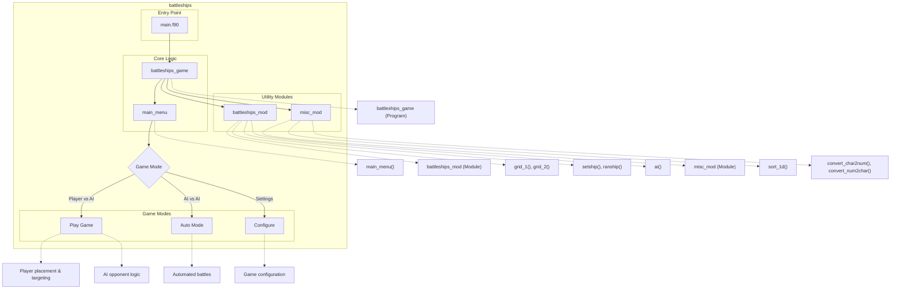

# Battleships Fortran

A classic Battleships game implemented in Fortran, providing both player vs. computer and computer vs. computer gameplay modes. This implementation features a complete command-line interface with interactive menus, a robust AI opponent with multiple difficulty levels, and traditional Battleships gameplay where players strategically place ships and attempt to sink their opponent's fleet.

## Key Features

- Interactive console interface with ASCII art logo and game boards
- Multiple gameplay modes (player vs. AI, AI vs. AI)
- Intelligent AI opponent with three-stage targeting strategy
- Ship placement system (manual or random)
- Configurable settings including time delays and random seeds
- Scoring system tracking hits, misses, and ship health
- Clean visualization of dual game boards (defense and offense)
- Comprehensive error handling for ship placement
- Support for classic Battleships rules and ship configurations

# Layout and Architecture
```
└── darius
    ├── c3-dariuszucker-darius-470889e  # Latest version of the Battleships game
    │   ├── CMakeLists.txt              # Build configuration
    │   ├── LICENSE
    │   ├── README.md                   # Project documentation
    │   ├── battleships.f90             # Core game module with ship management, grid display and AI
    │   ├── main.f90                    # Main program with game logic and menus
    │   ├── misc.f90                    # Utility module with string/array functions
    │   └── sleep.c                     # C implementation of sleep function
    └── c3-dariuszucker-darius-ee4ee60  # Earlier version of the project
        ├── CMakeLists.txt
        ├── LICENSE
        ├── README.md
        ├── battleships.f90
        ├── main.f90
        ├── misc.f90
        └── sleep.c
```



# Usage Examples

## Building the Game

### Using CMake

```sh
# Create a build directory and configure
cmake -B build
# Build the game
cmake --build build
```

### Using Fortran Package Manager (FPM)

```sh
# Build and run the game with FPM
fpm run
```

## Running the Game

### Launch the Game

```sh
# Run the compiled executable
build/battleships
```

## Gameplay Features

### Main Menu Navigation

The game offers several options at the main menu:
```
1 - Place your ships
2 - Begin battle!
3 - Watch an automated battle
4 - About
```

### Ship Placement

#### Manual Ship Placement

```
# Choose option 1 from main menu
# Select ships (2-6) to place on the board
# For each ship, enter coordinates (e.g., "A1") and direction (N, E, S, W)
```

#### Automatic Ship Placement

```
# Choose option 1 from main menu
# Select option 7 to auto-assign ships
# Confirm with 'Y' when prompted
```

### Battle Modes

#### Player vs Computer

```
# After placing ships, select option 2 from main menu
# Enter firing coordinates when prompted (e.g., "B5")
# Computer will take turns automatically
```

#### Computer vs Computer

```
# Select option 3 from main menu
# Confirm with 'Y' when prompted
# Watch the automated battle between two AI opponents
```

### Game Display

```
# During the game, the display shows:
# - Defence grid (your ships)
# - Offence grid (your shots at enemy)
# - Scoreboard with hits
# - Health status of ships
```

## Utility Functions

### Grid Display Functions

```fortran
! Display a single grid
CALL grid_1(defence, 'd')  ! 'd' for defence grid

! Display two grids side by side
CALL grid_2(defence, offence)  ! Shows defence and offence grids
```

### Ship Management

```fortran
! Place a ship on the grid
CALL setship(player1(1), defence)  ! Places first ship on defence grid

! Remove a ship from the grid
CALL clearship(player1(1), defence)  ! Removes first ship from defence grid

! Randomly place all ships
CALL ranship(player1, defence)  ! Randomly places all ships on defence grid
```

### Game State Display

```fortran
! Display scoreboard with player statistics
CALL scoreboard(hits_title, hits)  ! Shows hit statistics

! Display the game logo/title screen
CALL logo()  ! Shows the Battleships ASCII art logo
```

### Target and Hit Processing

```fortran
! Display the target coordinates
CALL display_target(x, y)  ! Shows which coordinates are being targeted

! Identify which ship was hit and check if it was sunk
CALL identify(target, ships, hit_ship, sunk)  ! Processes hit information
```

# Battleships Game Implementation Deep Dive

This document provides a detailed analysis of key features in the Fortran Battleships game implementation. The game is a modern implementation of the classic Battleships game written in Fortran 2008, offering both human vs. computer and computer vs. computer gameplay modes.

## Key Feature 1: AI Implementation

The artificial intelligence in the game represents one of the most sophisticated features, implementing a multi-stage targeting strategy that mimics human gameplay patterns.

### Implementation Details

The AI is implemented in the `ai` subroutine within the `battleships_mod` module and operates through a three-stage strategy:

1. **Stage 1: Random Targeting (Hunting Mode)**
   - The AI begins by randomly selecting coordinates to fire at
   - Once a hit is registered, it transitions to Stage 2
   - Code excerpt:
   ```fortran
   CASE (1) ! New Target
     DO
       CALL RANDOM_NUMBER(random); random = random*10.0 + 1.0
       p0t%x = INT(random(1)); p0t%y = INT(random(2))
       p0t%s = defence(p0t%x, p0t%y) ! query array at point for complete state
       IF(p0t%s(2:2) == CB) EXIT ! not already fired at this position
     END DO
   ```

2. **Stage 2: Adjacent Targeting (Target Acquisition)**
   - After a successful hit, the AI targets adjacent squares in a clockwise or counter-clockwise pattern
   - It builds an `adjacent` array with four positions (north, east, south, west)
   - Invalid positions (off-grid or already fired at) are filtered out
   - Code excerpt:
   ```fortran
   CASE (2) ! stage
     ! A ship has been hit, begin firing at adjacent spaces until another hit is made
     
     ai_data%adjacent(1,1) = ai_data%centre(1)     ; ai_data%adjacent(1,2) = ai_data%centre(2) - 1 ! north
     ai_data%adjacent(2,1) = ai_data%centre(1) + 1 ; ai_data%adjacent(2,2) = ai_data%centre(2)     ! east
     ai_data%adjacent(3,1) = ai_data%centre(1)     ; ai_data%adjacent(3,2) = ai_data%centre(2) + 1 ! south
     ai_data%adjacent(4,1) = ai_data%centre(1) - 1 ; ai_data%adjacent(4,2) = ai_data%centre(2)     ! west
   ```

3. **Stage 3: Line Targeting (Ship Pursuit)**
   - Once a second hit on the same ship is made, the AI determines the ship's orientation
   - It then fires along that line in both directions until the ship is sunk or misses occur
   - A sophisticated line array tracks up to 9 positions in both directions from the center point
   - Code excerpt:
   ```fortran
   CASE (3) ! stage : Iterations of firing in one direction, then the other.
     ! Two hits in a row, the ship has not been sunk. Construct an array similar 
     ! to adjacent that contains available points
     
     ai_data%line(0,1:2) = ai_data%centre
     
     SELECT CASE(ai_data%pos)
       CASE (1) ! north
         ai_data%line(-4:4,1) = ai_data%centre(1) ! same x value for all points on vertical line
         DO i=-4,4
           ai_data%line(i,2) = ai_data%centre(2) - i ! different y values
         END DO
   ```

### AI State Management

The AI maintains its state across turns using the `ai_saved_data` derived type, which includes:

- Current targeting stage (1-3)
- Position tracking (center of hits, adjacent positions, line positions)
- Direction and orientation data
- Scan stages for progressive targeting

This persistent state enables the AI to implement complex targeting strategies across multiple turns, mimicking human gameplay patterns.

## Key Feature 2: Grid Management System

The game uses a sophisticated grid management system to represent and display the game state, handling multiple views of the same game board for different players.

### Implementation Details

1. **Board Representation**
   - The game board is represented as a 2D array of 2-character strings
   - The first character indicates the ship type or empty space
   - The second character indicates the state (blank, hit, or miss)
   - Code excerpt:
   ```fortran
   CHARACTER (LEN=2), DIMENSION(1:10,1:10) :: defence, comp, offence*1
   CHARACTER, PARAMETER :: CH = '*', CM = '.', CB = ' ', CN = '0'
   ```

2. **Ship Placement and Management**
   - Ships are stored as instances of the `ship` derived type, containing:
     - Position (x, y coordinates)
     - Direction (N, E, S, W)
     - Length (2-5 squares)
     - Hit count and sunk status
   - Code excerpt for ship representation:
   ```fortran
   TYPE ship
     INTEGER :: x, y, l, h
     CHARACTER (LEN=1) :: z, nu, nl, s
     CHARACTER (LEN=16) :: n
   END TYPE ship
   ```

3. **Grid Display System**
   - The game offers two display functions:
     - `grid_1`: Shows a single grid with compass directions
     - `grid_2`: Shows two grids side by side (defense and offense)
   - ASCII characters create grid lines and decorations
   - Code excerpt from grid display:
   ```fortran
   SUBROUTINE grid_2(a1,a2)
     CHARACTER (LEN=*), DIMENSION(:,:), INTENT(IN) :: a1, a2
     ! Display two side-by-side grids with headers and coordinates
     print '(15x,a,20x,a,13x,a)', 'DEFENCE','^','OFFENCE'
     print '(6x,11(a,2x),2x,a,7x,11(a,1x))', &
       &'A','B','C','D','E','F','G','H','I','J',GC//GC,'N','A','B','C','D','E','F','G','H','I','J','+'
   ```

### Ship Placement Features

1. **Manual Placement**
   - Players can manually place ships using coordinates and orientation
   - The `shipdata` subroutine handles user input and validation
   - Grid and collision checking prevent illegal placements

2. **Automatic Placement**
   - The `ranship` subroutine places ships randomly
   - Uses a smart algorithm that places larger ships first
   - Includes collision detection and boundary checking
   - Code excerpt:
   ```fortran
   SUBROUTINE ranship(boats,array)
     ! Set ship data (x,y,z) such that all ships are on the grid and no ships overlap
     ! Begin with longest ship, and fit others around existing ships
     INTEGER :: i, c1, c2
     REAL, DIMENSION(3) :: ran
     
     ! Sort ships by length in descending order
     CALL sort_1d(lengths,'d')
     
     ! Place ships in order of decreasing length
     DO i=1,SIZE(lengths)
       DO ! error checking loop
         ! Generate random position and orientation
         CALL RANDOM_NUMBER(ran)
         ran = ran*10.0 + 1.0
         ! Validate placement
         CALL checkship_grid(boats(i),c1)
         CALL checkship_collision(boats(i),array,c2)
         IF(c1 == 0 .AND. c2 == 0) THEN
           CALL setship(boats(i),array)
           EXIT
         END IF
       END DO
     END DO
   ```

## Key Feature 3: Game State Management and User Interface

The game implements a comprehensive state management system that tracks the progress of the game and presents it through a user-friendly interface.

### Implementation Details

1. **Game State Tracking**
   - Ship status (hit/miss/sunk) tracking
   - Player turn management
   - Score and health tracking with scoreboard displays
   - Ship identification after hits
   - Code excerpt for identifying hit ships:
   ```fortran
   SUBROUTINE identify(t,boats,i,s)
     ! Identify which ship was hit and determine if it has been sunk
     
     ! t%s(1:1) identifies ship by initial; need to convert to upper
     t%s(1:1) = toUpper(t%s(1:1))
     
     SELECT CASE (t%s(1:1))
       CASE ('D')
         i = 1
       CASE ('C')
         i = 2
       ! ...and so on
     END SELECT
     
     boats(i)%h = boats(i)%h + 1 ! ship has been hit
     IF(boats(i)%h == boats(i)%l) THEN ! is ship sunk?
       s = .TRUE.
     ELSE
       s = .FALSE.
     END IF
   ```

2. **User Interface Features**
   - ASCII art logo and game presentation
   - Menu-driven interface with multiple game modes
   - Clear screen functionality (`CLEAR_SCREEN = ESC // "[2J"`)
   - Input validation and error handling
   - Configuration file system for game settings

3. **Game Flow Control**
   - Main menu with options for ship placement, starting battle, automated battle
   - Turn-based gameplay with alternating player moves
   - Victory condition checking
   - Proper game termination and winner announcement

## Integration of Features

These key features work together to create a complete gaming experience:

1. The **Grid Management System** provides the foundation, representing the game state and allowing ship placement and targeting.

2. The **AI Implementation** uses the grid data to make intelligent decisions, creating a challenging opponent.

3. The **Game State Management** ties everything together, tracking progress, handling turns, and presenting information to players.

The game's architecture demonstrates good separation of concerns through its modular design:
- `misc_mod`: Utility functions for string manipulation and other helpers
- `battleships_mod`: Core game mechanics and AI logic
- `main.f90`: User interface and game flow control

This modular approach makes the code maintainable and facilitates potential future enhancements to individual components.

# Implemented User Stories

## Game Setup
- [x] As a player, I want to manually place my ships on the grid so that I can strategize my ship positioning
- [x] As a player, I want to have ships auto-assigned randomly so that I can start playing quickly
- [x] As a player, I want to see my ships displayed on a grid so that I can understand my fleet's position
- [x] As a player, I want to receive clear error messages when placing ships incorrectly so that I can fix my ship placement
- [x] As a player, I want to see help information about ship placement so that I understand the game mechanics

## Gameplay
- [x] As a player, I want to target specific coordinates on the enemy grid so that I can try to hit enemy ships
- [x] As a player, I want to see the results of my shots (hit or miss) on the enemy grid so that I can track my progress
- [x] As a player, I want to be notified when I successfully sink an enemy ship so that I can adjust my strategy
- [x] As a player, I want to track which coordinates I've already fired upon so that I don't waste turns
- [x] As a player, I want to see a visual representation of hits and misses on the grid so that I can plan my next moves
- [x] As a player, I want to be notified when all enemy ships are sunk so that I know I've won the game
- [x] As a player, I want to be notified when all my ships are sunk so that I know I've lost the game
- [x] As a player, I want to play against a computer opponent so that I can enjoy the game without a human opponent

## AI Opponent
- [x] As a player, I want the AI opponent to intelligently target my ships after scoring a hit so that the game provides a challenging experience
- [x] As a player, I want to observe the AI's targeting strategy so that I can learn from its tactics
- [x] As a spectator, I want to watch an automated battle between two AI players so that I can enjoy the game without participating

## Game Interface
- [x] As a player, I want to see a main menu with game options so that I can select my desired game mode
- [x] As a player, I want to see a scoreboard during gameplay so that I can track hits and ship status
- [x] As a player, I want to see ship health displayed during gameplay so that I can understand which ships are damaged
- [x] As a player, I want to see a visual representation of the game board with coordinates so that I can easily target positions
- [x] As a player, I want to see a decorative game logo so that I feel immersed in the game experience
- [x] As a player, I want to access information about the game's development so that I can learn about its creators

## Configuration
- [x] As a player, I want the game to save and load configuration settings so that my preferences persist between sessions
- [x] As a player, I want to control timing delays between game actions so that I can adjust the pace of gameplay
- [x] As a player, I want the game to utilize a random number generator with configurable seed so that game scenarios can be reproduced if desired

## Ship Management
- [x] As a player, I want a variety of ship types with different lengths (Destroyer, Cruiser, Submarine, Battleship, Aircraft Carrier) so that the game has strategic depth
- [x] As a player, I want to position ships in different orientations (N, E, S, W) so that I can create varied defensive layouts
- [x] As a player, I want the game to prevent ships from being placed off the grid so that all placements are valid
- [x] As a player, I want the game to prevent ships from overlapping so that all placements follow game rules