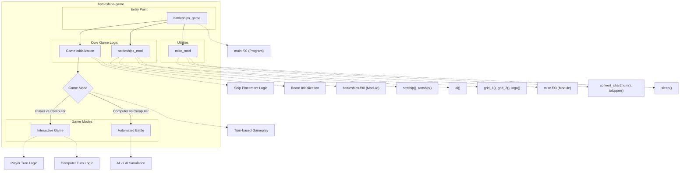

# Battleships Game

This repository contains a classic Battleships game implementation written in Fortran 90. The game features both player vs. computer and computer vs. computer (automated battle) modes where ships are placed on a grid and players take turns firing at their opponent's fleet. The game ends when all ships of one player are sunk.

## Key Features

- Interactive gameplay with text-based grid visualization
- Two game modes: player vs. computer and computer vs. computer (automated)
- Intelligent AI opponent with progressive targeting strategies
- Ship placement system (manual or random)
- Visual representation of hits, misses, and ship positions
- ASCII art game logo and stylized grid display
- Ship identification and sinking detection
- Scoreboard system to track hits and ship health
- Cross-platform compatibility

# Layout and Architecture
```
└── darius
    ├── c3-dariuszucker-darius-470889e  # Updated version of the codebase
    │   ├── CMakeLists.txt              # CMake build configuration
    │   ├── battleships.f90             # Main game module with ship/grid logic
    │   ├── main.f90                    # Game entry point and application logic
    │   ├── misc.f90                    # Utility functions for string/array manipulation
    │   └── sleep.c                     # C implementation of sleep function
    │
    └── c3-dariuszucker-darius-ee4ee60  # Earlier version of the codebase
        ├── CMakeLists.txt
        ├── battleships.f90
        ├── main.f90
        ├── misc.f90
        └── sleep.c
```



# Usage Examples

## Building

### Build from Source
```bash
# Create build directory and build project
mkdir -p build
cd build
cmake ..
make

# Install the game (optional)
make install
```

## Running the Game

### Launch Battleships Game
```bash
# From the build directory
./battleships
```

## Gameplay

### Main Menu Navigation
The game presents a main menu with the following options:
```
Main Menu
# Option
1 Place your ships
2 Begin battle!
3 Watch an automated battle
4 About
```
To select an option, enter the corresponding number.

### Ship Placement

#### Manual Ship Placement
```
# Place the Destroyer (length 2)
# Enter coordinates when prompted: e.g. A1
# Enter direction: N, E, S, or W
```

For example, to place a ship at position A1 facing North:
```
Enter x- and y- coordinates of ship's bow, from A1 to J10 [A-J 1-10]: A1
Enter direction of ship's bow [N,E,S,W]: N
```

#### Automatic Ship Placement
```
# Select option 7 from ship placement menu
# Confirm with Y when prompted
```

### Game Controls

#### Firing at Enemy Ships
```
# During your turn, enter coordinates to target
Enter target x- and y- coordinates, e.g. A2 or A10 [A-J 1-10]: C5
```

#### Watch Computer vs Computer Battle
```
# Select option 3 from the main menu
# Confirm with Y when prompted to see an automated battle between two AI players
```

## Game Features

### Display Functions

#### View Game Board
The game provides views of both the defense grid (your ships) and offense grid (your shots):
```
       DEFENCE                    ^               OFFENCE
++ A  B  C  D  E  F  G  H  I  J  ++    N       A B C D E F G H I J +
 1 -- -- -- -- -- -- -- -- -- -- || < W E >  1 - - - - - - - - - - |
 2 -- -- -- -- -- -- -- -- -- -- ||    S     2 - - - - - - - - - - |
 3 -- -- -- -- -- -- -- -- -- -- ||    v     3 - - - - - - - - - - |
```

#### View Scoreboard
During gameplay, the game displays:
```
   Score
    Player 1 : 0 / 5
    Player 2 : 0 / 5

   Health
    D : 2 / 2
    C : 3 / 3
    S : 3 / 3
    B : 4 / 4
    A : 5 / 5
```

### Ship Types
The game includes five ship types:
```
Ship            Symbol  Length
Destroyer         D d     2
Cruiser           C c     3
Submarine         S s     3
Battleship        B b     4
Aircraft Carrier  A a     5
```

## Advanced Usage

### Configuration
The game looks for a configuration file named `config.dat` in the current directory:
```
# Example config.dat file structure
[seed]
operation=save
bank=0
```

### Game Indicators
```
Hit indicator:  *  (asterisk)
Miss indicator: .  (dot)
```

# Battleships Game: Implementation Deep Dive

The Battleships game is a classic board game implemented in Fortran with features for player vs computer and computer vs computer gameplay. After examining the codebase, this document explores key features that form the core functionality of the application.

## Key Feature 1: AI Targeting System

One of the most sophisticated features in the Battleships game is the AI targeting system. Located in the `battleships_mod` module, the AI's targeting algorithm demonstrates an excellent example of how to implement intelligent opponent behavior.

### Implementation Details

The AI targeting system uses a three-stage targeting approach:

1. **Random Targeting (Stage 1)**: 
   ```fortran
   CASE (1) ! New Target
     DO
       CALL RANDOM_NUMBER(random); random = random*10.0 + 1.0
       p0t%x = INT(random(1)); p0t%y = INT(random(2))
       p0t%s = defence(p0t%x, p0t%y) ! query array at point for complete state
       IF(p0t%s(2:2) == CB) EXIT ! not already fired at this position
     END DO
   ```
   In this stage, the AI randomly selects grid coordinates to target until it finds a cell not previously targeted. Once the AI registers a hit, it transitions to Stage 2.

2. **Adjacent Space Targeting (Stage 2)**: 
   ```fortran
   CASE (2) ! stage
     ! A ship has been hit, begin firing at adjacent spaces until another hit is made, or all are miss/already fired at.
   ```
   After hitting a ship, the AI targets adjacent spaces (north, east, south, west) to identify the ship's orientation. The AI builds an `adjacent` array containing possible target positions and methodically works through them.

3. **Linear Targeting (Stage 3)**: 
   ```fortran
   CASE (3) ! stage : Iterations of firing in one direction, then the other.
     ! Two hits in a row, the ship has not been sunk. Construct an array similar to adjacent that contains available points
   ```
   Once the AI has identified the ship's orientation (by getting two hits), it switches to Stage 3, where it fires sequentially along the discovered line until it either sinks the ship or discovers it has reached the end of the ship, at which point it reverses direction.

The implementation uses a sophisticated state machine approach, storing all necessary state information in the `ai_saved_data` structure, which allows the AI to maintain targeting information across multiple turns:

```fortran
TYPE ai_saved_data
  INTEGER :: stage, pass, scan_stage, start, clock, pos, line_pos
  INTEGER, DIMENSION(1:2) :: centre, try
  INTEGER, DIMENSION(1:4,1:2) :: adjacent
  INTEGER, DIMENSION(-4:4,1:2) :: line
  LOGICAL :: first_time  = .TRUE.
END TYPE ai_saved_data
```

This design demonstrates effective use of a persistent state in a function that appears stateless to the caller, allowing the AI to build complex targeting strategies over multiple turns.

## Key Feature 2: Ship Placement and Validation

Ship placement is another critical feature of the game, involving both user input handling and validation to ensure game rules are followed.

### Implementation Details

Ship placement involves multiple components working together:

1. **Manual Ship Placement** (via `shipdata` subroutine):
   ```fortran
   SUBROUTINE shipdata(boat, array, error_grid, error_collision)
   ```
   This subroutine handles user input for ship coordinates and orientation (N, E, S, W), validating input against game rules.

2. **Random Ship Placement** (via `ranship` subroutine):
   ```fortran
   SUBROUTINE ranship(boats,array)
   ! set ship data (x,y,z) such that all ships are on the grid and no ships overlap
   ! begin with longest ship, and fit others around existing ships
   ```
   The algorithm sorts ships by length (descending) and places larger ships first, repeatedly attempting random placements until valid positions are found.

3. **Validation Logic**:
   - `checkship_grid` ensures ships stay within grid boundaries:
     ```fortran
     SUBROUTINE checkship_grid(boat, c)
     ```
   - `checkship_collision` ensures ships don't overlap:
     ```fortran
     SUBROUTINE checkship_collision(boat, array, c)
     ```

The ship placement system shows effective separation of concerns:
- Input handling in `shipdata`
- Validation through `checkship_grid` and `checkship_collision`
- Ship visualization through `setship`

This design makes each component testable and reusable. For example, both the manual placement and random placement use the same validation routines, ensuring consistency.

## Key Feature 3: Game State Management

The Battleships game maintains complex state information across multiple players and game elements, demonstrating effective design for game state management.

### Implementation Details

The game state is managed through several custom types and arrays:

1. **Ship Representation** using custom types:
   ```fortran
   TYPE ship
     INTEGER :: x, y, l, h
     CHARACTER (LEN=1) :: z, nu, nl, s
     CHARACTER (LEN=16) :: n
   END TYPE ship
   ```
   Each ship tracks its position (x, y), length (l), hits taken (h), orientation (z), and display characters.

2. **Grid Management** through character arrays:
   ```fortran
   CHARACTER (LEN=2), DIMENSION(1:10,1:10) :: defence, comp, offence*1
   ```
   The game maintains separate grids for the player's ships (`defence`), the computer's ships (`comp`), and the player's targeting history (`offence`).

3. **Game Progress Tracking** with logical arrays and scoreboard entities:
   ```fortran
   LOGICAL, DIMENSION(1:5) :: p1sunk, p2sunk
   TYPE(scoreboard_entity), DIMENSION(1:2) :: hits
   TYPE(scoreboard_entity), DIMENSION(1:5) :: health
   ```
   The game tracks which ships are sunk using boolean arrays and maintains scoring information through custom scoreboard entities.

The game loop in the main program efficiently manages turn-based gameplay using this state:

```fortran
DO ! round loop
  ! Player 1's turn
  print '(/,a,i2,/)', 'Round ',r
  print '(a)', "Player 1's turn."
  
  ! Player turn logic...
  
  ! Player 2's turn
  print '(/,a)', "Player 2's turn."
  CALL ai(defence, player1, p1sunk, hits, 2, delay, ai2, health)
  
  ! Check win conditions
  IF(ALL(p2sunk) .OR. ALL(p1sunk)) EXIT ! exit round loop
  
  r = r + 1
END DO
```

The design demonstrates effective separation between game logic, state management, and display logic, allowing the game to support multiple play modes (player vs computer and computer vs computer) with minimal code duplication.

## Conclusion

The Battleships implementation demonstrates several strong design choices:

1. **Modular Design**: The codebase separates concerns between modules (battleships_mod for game logic, misc_mod for utilities).

2. **State Management**: The game effectively manages complex state through custom types and arrays.

3. **Intelligent AI**: The three-stage AI targeting system shows sophisticated algorithm design that mimics human targeting strategies.

4. **Validation Logic**: The ship placement system includes thorough validation to ensure game rules are followed.

Developers looking to extend this codebase could consider:

1. Adding network multiplayer functionality
2. Enhancing the AI with additional strategies
3. Implementing a graphical user interface
4. Adding more game variants or custom rule sets

The existing architecture provides a solid foundation for these enhancements due to its modular design and clear separation of concerns.

# Implemented User Stories

## Game Setup
- [ ] As a player, I want to place ships on my grid manually, so that I can strategically position my fleet
- [ ] As a player, I want the option to auto-assign ships on my grid, so that I can quickly start a game
- [ ] As a player, I want to see a visual representation of my ship placements, so that I can understand the game state
- [ ] As a player, I want help information about ship placement, so that I can understand how to properly position my ships
- [ ] As a player, I want to be warned about invalid ship placements (off-grid or colliding), so that I can correct my strategy

## Gameplay
- [ ] As a player, I want to target specific coordinates on my opponent's grid, so that I can try to hit their ships
- [ ] As a player, I want to see the results of my shots (hit or miss), so that I can refine my targeting strategy
- [ ] As a player, I want to see when I've sunk an opponent's ship, so that I can track my progress
- [ ] As a player, I want to see which of my ships have been hit, so that I can understand my defensive situation
- [ ] As a player, I want to see a scoreboard showing hits and ship health, so that I can track the game status
- [ ] As a player, I want visual indicators for hits, misses, and ship positions, so that I can easily understand the game state

## AI Opponent
- [ ] As a player, I want to battle against a computer opponent with intelligent targeting, so that the game is challenging
- [ ] As a player, I want to see the computer's moves and results, so that I understand what's happening in the game
- [ ] As a player, I want to be notified when the computer sinks one of my ships, so that I'm aware of my fleet's status

## Game Options
- [ ] As a player, I want to watch an automated battle between two computer opponents, so that I can learn strategies or be entertained
- [ ] As a player, I want to access information about the game, so that I can learn about its development history
- [ ] As a player, I want to be able to control game timing (delays), so that I can adjust the pace of play to my preference

## Game Conclusion
- [ ] As a player, I want to know when the game ends with a clear win, loss, or draw message, so that I understand the outcome
- [ ] As a player, I want to return to the main menu after a game, so that I can start a new game or exit

## User Interface
- [ ] As a player, I want to see a clear game logo and menu system, so that I can easily navigate the game
- [ ] As a player, I want to see both my defense grid and offense grid side by side, so that I can track all game information at once
- [ ] As a player, I want a compass indicator on the defense grid, so that I can easily understand ship orientation

## Configuration
- [ ] As a player, I want game settings to be saved, so that my preferences persist between play sessions
- [ ] As a player, I want to be able to configure game options, so that I can customize my experience

## Ship Management
- [ ] As a player, I want five different ship types with varying lengths, so that the game has strategic depth
- [ ] As a player, I want to see the health status of each ship, so that I can track damage during the game