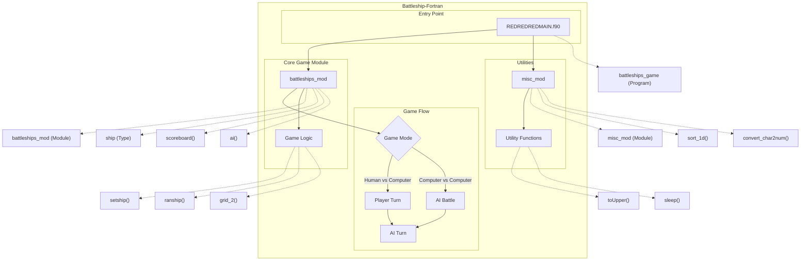

# Battleships Fortran

A feature-complete Battleships game implemented in Fortran. This classic naval combat game allows players to strategically place ships on a grid and take turns firing at the opponent's fleet with the goal of sinking all enemy vessels. The implementation supports both human-versus-computer and computer-versus-computer gameplay modes with an intelligent AI opponent that uses systematic targeting strategies.

## Key Features

- Classic Battleships gameplay with a 10x10 grid system
- Multiple game modes: human vs. computer or computer vs. computer
- Intelligent AI opponent with progressive search strategy
- ASCII art interface with grid display and game logo
- Customizable game configuration via external settings
- Real-time score tracking and statistics
- Ship placement validation to prevent boundary violations and overlaps
- Random ship placement option for quick game setup
- Configurable game speed with delay options

# Layout and Architecture
```
└── darius/                           # Main project directory
    ├── CMakeLists.txt                # CMake build configuration
    ├── LICENSE                       # Project license
    ├── README.md                     # Current project documentation
    ├── README.md_v1                  # Previous version of documentation
    ├── README.md_v2                  # Previous version of documentation
    ├── REDREDREDMAIN.f90             # Main battleships game program
    ├── battleships.f90               # Core battleships game logic and types
    ├── fpm.toml                      # Fortran Package Manager configuration
    ├── main.f90                      # Alternate entry point
    ├── misc.f90                      # Utility functions (string manipulation, sorting, etc.)
    ├── sleep.c                       # C implementation of sleep function
    └── test.f90                      # Test suite
```



# Usage Examples

## Building the Game

### Using CMake

```bash
mkdir build
cd build
cmake ..
cmake --build build
```

### Using Fortran Package Manager (FPM)

```bash
fpm build
```

## Running the Game

### Starting the Game

```bash
# If built with CMake
build/battleships

# If built with FPM
fpm run
```

## Game Mechanics

### Ship Placement

#### Manual Ship Placement
```fortran
! When prompted, enter ship bow coordinates like A1, B5, etc.
! Then enter direction N, E, S, or W when prompted
! Example:
! <I> Enter x- and y- coordinates of ship's bow, from A1 to J10 [A-J 1-10]: E5
! <I> Enter direction of ship's bow [N,E,S,W]: N
```

#### Random Ship Placement
```fortran
! Select option 7 from the ship placement menu
! Confirm with Y when prompted
```

### Targeting

```fortran
! Enter coordinates like A1, B5, etc. when prompted
! <I> Enter target x- and y- coordinates, e.g. A2 or A10 [A-J 1-10]: D7
```

### Watch AI Battle

```fortran
! Select option 3 from the main menu
! Confirm with Y when prompted
```

## Module Usage Examples

### String Manipulation with misc_mod

```fortran
use misc_mod, only: convert_num2char, convert_char2num, toUpper

! Convert a number to letter coordinates
integer :: col = 5
character :: col_letter
call convert_num2char(col, col_letter)
! col_letter will be 'E'

! Convert a letter coordinate to number
character :: input_col = 'C'
integer :: col_num
call convert_char2num(input_col, col_num)
! col_num will be 3

! Convert lowercase to uppercase
character :: input = 'a'
character :: output
output = toUpper(input)
! output will be 'A'
```

### Game Board Operations with battleships_mod

```fortran
use battleships_mod, only: ship, grid_1, grid_2, setship, clearship, ranship

! Define a ship
type(ship) :: destroyer
destroyer%x = 3        ! X coordinate (C)
destroyer%y = 4        ! Y coordinate (4)
destroyer%z = 'N'      ! Direction (North)
destroyer%l = 2        ! Length
destroyer%nu = 'D'     ! Uppercase identifier
destroyer%nl = 'd'     ! Lowercase identifier
destroyer%s = ' '      ! State (not sunk)
destroyer%n = 'Destroyer'  ! Name
destroyer%h = 0        ! Hits taken

! Place ship on board
character(len=2), dimension(10,10) :: defence_grid
call setship(destroyer, defence_grid)

! Remove ship from board
call clearship(destroyer, defence_grid)

! Display single grid
call grid_1(defence_grid, 'd')  ! 'd' for defence grid

! Display both defence and offence grids side by side
character(len=1), dimension(10,10) :: offence_grid
call grid_2(defence_grid, offence_grid)

! Place ships randomly
type(ship), dimension(5) :: fleet
call ranship(fleet, defence_grid)
```

### AI Opponent

```fortran
use battleships_mod, only: ai, ai_saved_data, ship, scoreboard_entity

! Initialize AI data structure
type(ai_saved_data) :: ai_data

! Setup game state
character(len=2), dimension(10,10) :: defence_grid
type(ship), dimension(5) :: player_ships
logical, dimension(5) :: sunk_status = .false.
type(scoreboard_entity), dimension(2) :: score
type(scoreboard_entity), dimension(5) :: health
logical :: delay_output = .true.

! Make AI move
call ai(defence_grid, player_ships, sunk_status, score, 2, delay_output, ai_data, health)
```

### Scoreboard Display

```fortran
use battleships_mod, only: scoreboard, scoreboard_entity

! Setup score entities
type(scoreboard_entity), dimension(2) :: players
players(1)%n = "Player 1"
players(1)%s = 3    ! Score (ships sunk)
players(1)%t = 5    ! Total possible
players(2)%n = "AI"
players(2)%s = 2
players(2)%t = 5

! Display scoreboard
call scoreboard("Score", players)
```

# Darius Battleship Game: Key Feature Implementation Deep Dive

After analyzing the codebase of the Battleship game, here are detailed deep dives into three core features that are essential to the game's functionality.

## 1. Ship Placement System

The ship placement system is a core feature that allows players to set up their battleships on the game grid before starting the game. It encompasses both manual and automated placement options.

### Implementation Overview

The ship placement feature is implemented through several interconnected components:

1. **Ship Data Structure**: Defined in `battleships.f90` as the `ship` type:
   ```fortran
   TYPE ship
     INTEGER :: x, y, l, h
     CHARACTER (LEN=1) :: z, nu, nl, s
     CHARACTER (LEN=16) :: n
   END TYPE ship
   ```
   - `x, y`: Bow (front) position coordinates
   - `z`: Direction of the ship (N, E, S, W)
   - `l`: Length of the ship
   - `h`: Number of hits on the ship
   - `nu`, `nl`: Upper and lowercase letters representing the ship
   - `n`: Ship name (e.g., "Destroyer", "Aircraft Carrier")

2. **Manual Placement System**: Implemented in the main program (`REDREDREDMAIN.f90`) through a menu-driven interface and the `shipdata` subroutine in `battleships_mod`. The workflow is:
   - User selects a ship from the menu
   - `shipdata` prompts for bow position coordinates and direction
   - Input validation is performed by `checkship_grid` and `checkship_collision`
   - If placement is valid, `setship` places the ship on the grid

3. **Validation Routines**:
   - `checkship_grid` ensures the ship fits within the 10×10 grid boundaries
   - `checkship_collision` checks that the ship doesn't overlap with existing ships

4. **Automated Placement**: Implemented via the `ranship` subroutine, which:
   - Sorts ships by descending length (using `sort_1d` from `misc_mod`)
   - Places ships one by one, starting with the largest
   - Generates random coordinates and orientation
   - Validates placement using the same validation routines
   - Retries until valid positions are found for all ships

### Key Implementation Details

The ship placement system demonstrates several software engineering principles:

1. **Separation of Concerns**: The placement logic is separated into distinct subroutines:
   - `shipdata`: User input handling
   - `checkship_grid`/`checkship_collision`: Validation 
   - `setship`/`clearship`: Grid manipulation
   - `ranship`: Automated placement algorithm

2. **Error Handling**: Robust validation using the variables `error_grid` and `error_collision`:
   ```fortran
   CALL checkship_grid(boat, error_grid)
   CALL checkship_collision(boat, array, error_collision)
   IF(error_grid == 0 .AND. error_collision == 0) THEN
     CALL setship(boat, array)
   END IF
   ```

3. **Persistence**: The game maintains the ship arrangement across turns and enables clearing/resetting it when needed.

## 2. AI Targeting System

The AI targeting system is one of the most sophisticated features, implementing a multi-stage targeting algorithm that simulates a computer opponent with intelligent ship-hunting capabilities.

### Implementation Overview

The AI system is implemented in the `ai` subroutine in `battleships_mod`. It uses a three-stage strategy to find and sink enemy ships:

1. **Stage 1 - Random Targeting**: Initial shots are random until a hit is scored
   ```fortran
   CALL RANDOM_NUMBER(random); random = random*10.0 + 1.0
   p0t%x = INT(random(1)); p0t%y = INT(random(2))
   ```

2. **Stage 2 - Adjacent Space Targeting**: After a hit, the AI checks adjacent spaces (N, E, S, W) to determine ship orientation
   ```fortran
   ai_data%adjacent(1,1) = ai_data%centre(1)     ; ai_data%adjacent(1,2) = ai_data%centre(2) - 1 ! north
   ai_data%adjacent(2,1) = ai_data%centre(1) + 1 ; ai_data%adjacent(2,2) = ai_data%centre(2)     ! east
   ai_data%adjacent(3,1) = ai_data%centre(1)     ; ai_data%adjacent(3,2) = ai_data%centre(2) + 1 ! south
   ai_data%adjacent(4,1) = ai_data%centre(1) - 1 ; ai_data%adjacent(4,2) = ai_data%centre(2)     ! west
   ```

3. **Stage 3 - Line Targeting**: Once ship orientation is determined (by finding two hits in a row), the AI fires along that line to sink the ship
   ```fortran
   ai_data%line(-4:4,1) = ai_data%centre(1) ! same x value for all points on vertical line
   DO i=-4,4
     ai_data%line(i,2) = ai_data%centre(2) - i ! different y values
   END DO
   ```

### Key Implementation Details

1. **State Management**: Uses the `ai_saved_data` type to maintain AI state between turns:
   ```fortran
   TYPE ai_saved_data
     INTEGER :: stage, pass, scan_stage, start, clock, pos, line_pos
     INTEGER, DIMENSION(1:2) :: centre, try
     INTEGER, DIMENSION(1:4,1:2) :: adjacent
     INTEGER, DIMENSION(-4:4,1:2) :: line
     LOGICAL :: first_time = .TRUE.
   END TYPE ai_saved_data
   ```

2. **Adaptive Targeting**: The AI adapts its strategy based on previous results:
   - After a hit, it remembers the position and switches to adjacent targeting
   - After two hits, it determines ship orientation and continues along that line
   - After sinking a ship, it returns to random targeting

3. **Validation and Filtering**: The AI filters invalid targets (off-grid or already fired) at each stage:
   ```fortran
   IF(ai_data%adjacent(i,1) >= 1 .AND. ai_data%adjacent(i,1) <= 10 .AND. &
     &  ai_data%adjacent(i,2) >= 1 .AND. ai_data%adjacent(i,2) <= 10) CYCLE
   ai_data%adjacent(i,1:2) = -1 ! points off the grid will be ignored
   ```

4. **Direction Selection**: Uses a clever system for selecting and rotating through firing directions:
   ```fortran
   ! select a random direction to rotate for subsequent firing around centre point
   DO ! clock can only be [1,2=-1] = [c,a]
     CALL RANDOM_NUMBER(random(2)); random(2) = random(2)*10.0 + 1.0
     IF(INT(random(2)) >= 1 .AND. INT(random(2)) <= 2) EXIT
   END DO
   ai_data%clock = INT(random(2))
   IF(ai_data%clock == 2) ai_data%clock = -1 ! for anticlockwise rotation
   ```

## 3. Grid Display and Game State Management

The grid display and game state management system provides the visual representation of the game board and tracks the state of all ships and shots fired during gameplay.

### Implementation Overview

1. **Grid Representation**: The game uses multiple 2D character arrays to track different aspects of the game state:
   - `defence`: The player's ships and hits received
   - `offence`: The player's view of shots fired at the opponent
   - `comp`: The computer's ship arrangement

2. **Display Routines**: Implemented via three key subroutines:
   - `grid_1`: Displays a single player's grid
   - `grid_2`: Displays both player and computer grids side by side
   - `scoreboard`: Shows hit counts and ship health

3. **Game State Constants**: Visual representation uses defined character constants:
   ```fortran
   CHARACTER, PARAMETER :: CH = '*', CM = '.', CB = ' ', CN = '0', GSV = '|', GSH = '=', GC = '+'
   ```
   - `CH`: Character representing a hit
   - `CM`: Character representing a miss
   - `CB`: Character representing empty space
   - `GSV`, `GSH`, `GC`: Grid formatting elements

### Key Implementation Details

1. **Grid Data Structure**: Each grid cell stores multiple pieces of information:
   - For `defence` and `comp`, cells use a 2-character string where:
     - First character: Ship identifier or blank space
     - Second character: Hit/miss status or blank
   - For `offence`, cells use a single character showing only hit/miss status

2. **Ship State Tracking**: The game tracks each ship's state via:
   - `p1sunk` and `p2sunk`: Boolean arrays indicating if each ship is sunk
   - The `h` field in the ship structure tracking hit count
   - The `health` scoreboard showing remaining ship health

3. **Coordinate System Handling**: Converts between human-readable coordinates (A1, B5, etc.) and array indices using utility functions from `misc_mod`:
   ```fortran
   SUBROUTINE convert_char2num(c,i)  ! Converts 'A'-'J' to 1-10
   SUBROUTINE convert_charnum2num(c,i)  ! Converts "1"-"10" to 1-10
   SUBROUTINE convert_num2char(i,c)  ! Converts 1-10 to 'A'-'J'
   ```

4. **Target Processing**: When a shot is fired, the system:
   - Validates the target is within bounds and not previously targeted
   - Updates the appropriate grid with hit/miss marker
   - Identifies the hit ship and updates its hit count
   - Determines if the ship is sunk and updates scoreboard
   - Provides appropriate feedback messages

The grid display and game state management system creates an intuitive visual interface while efficiently tracking all necessary game data, forming the foundation that connects the ship placement and AI targeting systems together.

## Summary

These three key features—Ship Placement System, AI Targeting System, and Grid Display/Game State Management—form the core of the Battleship game implementation. 

The code demonstrates good software engineering practices including:

1. **Modular Design**: Functions and subroutines with clear, single responsibilities
2. **Type-Based Programming**: Custom types for ships, targets, and AI data
3. **State Management**: Careful tracking of game state across turns
4. **Input Validation**: Thorough checking of user input and game constraints
5. **Progressive AI Logic**: Multi-stage targeting algorithm with increasing intelligence

Developers looking to improve or extend the game could focus on:
- Enhanced AI algorithms with probability-based targeting
- Network multiplayer support
- Graphical user interface implementation
- Additional game modes or rule variations

# Implemented User Stories

## Game Setup and Configuration
- [ ] As a player, I want to see a clear main menu with game options, so that I can navigate through the game.
- [ ] As a player, I want to see the Battleships game logo when I start the game, so that I know what game I'm playing.
- [ ] As a player, I want to customize game settings through a configuration file, so that I can adjust the gameplay to my preferences.
- [ ] As a player, I want to toggle the delay between game actions, so that I can control the pace of the game.
- [ ] As a player, I want to read help instructions about ship placement, so that I can understand how to set up my fleet.

## Ship Placement
- [ ] As a player, I want to manually place my ships on the grid by specifying coordinates and orientation, so that I can strategically position my fleet.
- [ ] As a player, I want to see visual feedback if my ship placement is invalid (off-grid or collision), so that I can correct my placement.
- [ ] As a player, I want to automatically place my ships randomly on the grid, so that I can start playing quickly without manual setup.
- [ ] As a player, I want to clear my current ship arrangement and start over, so that I can try different strategic setups.
- [ ] As a player, I want to see a visual representation of my ship placement on the grid, so that I can confirm my fleet's position.

## Gameplay Mechanics
- [ ] As a player, I want to target specific coordinates on my opponent's grid, so that I can try to hit their ships.
- [ ] As a player, I want to see the result of my attack (hit or miss), so that I can adjust my strategy accordingly.
- [ ] As a player, I want to see a visual representation of hits and misses on the grid, so that I can track my attacks.
- [ ] As a player, I want to be notified when I've sunk an enemy ship, so that I know my progress in defeating the opponent.
- [ ] As a player, I want to see which of my ships have been hit or sunk, so that I can understand my defensive situation.
- [ ] As a player, I want the game to track and display the score (ships sunk), so that I can see who is winning.
- [ ] As a player, I want to be notified when all ships are sunk and the game is over, so that I know who won.

## Game Modes and AI
- [ ] As a player, I want to play against a computer opponent with intelligent targeting, so that I can enjoy a challenging single-player experience.
- [ ] As a spectator, I want to watch an automated battle between two computer opponents, so that I can observe different strategies without playing.
- [ ] As a player facing the AI, I want the computer to use progressive targeting strategies when it gets a hit, so that the game provides a realistic challenge.
- [ ] As a player, I want the computer opponent to display different behaviors based on game state (random firing, targeted firing, line firing), so that it feels like a smart opponent.

## Game Interface
- [ ] As a player, I want to see a well-formatted game grid with labeled coordinates, so that I can easily identify positions.
- [ ] As a player, I want to see a compass on my defence grid, so that I can understand the orientation directions (N,E,S,W).
- [ ] As a player, I want to see both my defence grid and attack grid side by side, so that I can track both my ships and my attacks.
- [ ] As a player, I want to see a scoreboard showing hit statistics, so that I can track game progress.
- [ ] As a player, I want to see the health status of my ships, so that I know which are damaged or sunk.

## Utilities and System
- [ ] As a developer, I want string manipulation utilities (toUpper, strip_spaces), so that I can normalize user input.
- [ ] As a developer, I want number-character conversion utilities, so that I can translate between grid coordinates and internal representations.
- [ ] As a developer, I want sorting algorithms for arrays, so that I can order game elements when needed.
- [ ] As a developer, I want a sleep function to control timing, so that I can add pauses between game actions.
- [ ] As a developer, I want robust error handling for user input, so that the game can gracefully handle invalid inputs.