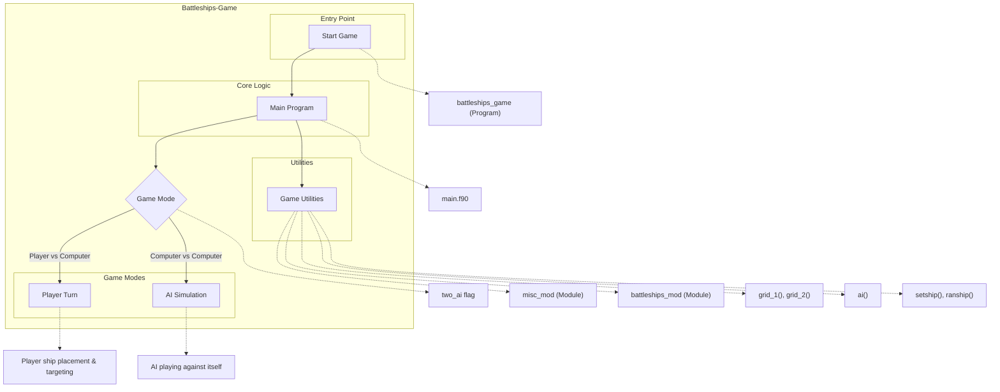

# Battleships Game

This repository contains a text-based implementation of the classic Battleships game written in Fortran. The game allows players to engage in naval combat against a computer opponent or watch two computer opponents battle each other. Players can strategically place ships on a grid, take turns firing at enemy vessels, and track hits and misses across the battlefield.

The implementation features a modular design with separate components for game logic, utility functions, and AI opponent behavior. The game provides visual representation of the battlefield using ASCII graphics, complete with coordinate systems and ship status tracking.

## Key Features

- **Multiple Game Modes**: Play against a computer opponent or watch computer vs computer gameplay
- **Interactive Ship Placement**: Place ships manually or use random placement
- **Intelligent AI Opponent**: Computer uses strategic targeting with progressive hunting techniques
- **Visual Grid Display**: ASCII-based representation of game boards with coordinate systems
- **Ship Status Tracking**: Monitor which ships have been hit and sunk
- **Scoring System**: Track hits and ship health throughout the game
- **Cross-platform Compatibility**: Built with standard Fortran with minimal system dependencies

# Layout and Architecture
```
└── darius
    ├── c3-dariuszucker-darius-470889e      # Latest version of battleships game
    │   ├── battleships.f90                 # Core game module (ship types, board functions, AI logic)
    │   ├── main.f90                        # Main game program (gameplay loop, user interactions)
    │   ├── misc.f90                        # Utility module (string functions, sorting, conversions)
    │   ├── sleep.c                         # C implementation of sleep function
    │   ├── CMakeLists.txt                  # Build configuration
    │   ├── fpm.toml                        # Fortran package manager config
    │   ├── README.md                       # Documentation
    │   └── ...                             # Other documentation files
    │
    └── c3-dariuszucker-darius-ee4ee60      # Older version of battleships game
        ├── battleships.f90
        ├── main.f90
        ├── misc.f90
        ├── sleep.c
        └── ...                             # Build and documentation files
```



# Usage Examples

## Build and Installation

### Building with CMake

The Battleships game uses CMake as its build system.

```bash
# Create build directory
mkdir build && cd build

# Configure project
cmake ..

# Build the project
cmake --build .

# Install (optional)
cmake --install .
```

### Building with Fortran Package Manager (fpm)

The game also supports building with fpm:

```bash
# Build the project
fpm build

# Run the game
fpm run
```

## Game Basics

### Running the Game

After building, you can run the game:

```bash
# Run from build directory
./battleships
```

## Ship Placement

### Manual Ship Placement

```fortran
! Example of placing a ship
! User will be prompted for coordinates (e.g., "A1") and direction (N,E,S,W)
! Typical input sequence:
! 1. Enter coordinates: A1
! 2. Enter direction: N
```

### Random Ship Placement

```fortran
! Select option 7 from the ship placement menu to automatically
! place ships in random positions on the grid
```

## Gameplay

### Targeting Enemy Ships

```fortran
! During your turn, enter target coordinates
! Example: A5
! The game will report if it's a hit or miss
```

### Understanding the Interface

```fortran
! Defense grid shows your ships and where the enemy has fired
! Offense grid shows where you've fired and if you hit/missed
! Hit markers are shown with '*'
! Miss markers are shown with '.'
```

## Utility Functions

### String Manipulation

```fortran
! Convert character to uppercase
character :: result, input = 'a'
result = toUpper(input)  ! result will be 'A'

! Convert between character and numeric coordinates
character :: col
integer :: num
call convert_num2char(5, col)  ! col will be 'E'
call convert_char2num('B', num)  ! num will be 2
```

### Array Operations

```fortran
! Sort a 1D integer array
integer, dimension(5) :: array = [5, 3, 1, 4, 2]
call sort_1d(array, 'a')  ! 'a' for ascending order
! array will be [1, 2, 3, 4, 5]

! Remove spaces from a string
character(len=32) :: text = "Hello World"
call strip_spaces(text)  ! text will be "HelloWorld    "
```

## AI Gameplay

### Watching Computer vs Computer Battle

```fortran
! Select option 3 from the main menu to watch an automated battle
! between two AI opponents
```

### Understanding AI Logic

The AI follows a three-stage targeting strategy:

1. Random targeting until it scores a hit
2. Targeting adjacent spaces after scoring a hit
3. Line-based targeting after two hits on the same ship

# Key Feature Implementation Deep Dive: Battleships Game

After examining the codebase, I've identified three key features that form the core functionality of the Battleships game. Let's explore their implementation in detail:

## 1. Ship Placement & Grid Management

The ship placement system is a foundational feature of the game, allowing players to position their ships on the game board either manually or automatically.

### Implementation

The ship placement system revolves around several key components:

- **Ship Data Structure**: Defined in the `battleships_mod` module as the `ship` type, containing properties:
  ```fortran
  TYPE ship
    INTEGER :: x, y, l, h
    CHARACTER (LEN=1) :: z, nu, nl, s
    CHARACTER (LEN=16) :: n
  END TYPE ship
  ```
  Where:
  - `x`, `y`: Coordinates of the ship's bow
  - `l`: Length of the ship
  - `h`: Number of hits taken
  - `z`: Direction the ship is facing ('N', 'E', 'S', 'W')
  - `nu`, `nl`: Uppercase and lowercase characters used for display
  - `s`: State of the ship ('-' for normal, 'S' for sunk)
  - `n`: Ship name

- **Grid Representation**: The game uses 2D character arrays to represent the game boards:
  ```fortran
  CHARACTER (LEN=2), DIMENSION(1:10,1:10) :: defence, comp, offence*1
  ```
  Each cell contains information about what occupies that space (a ship identifier or blank) and its status.

- **Ship Placement Logic**: 
  - Manual placement through `shipdata()` which handles user input
  - Automatic placement through `ranship()` which randomly positions ships
  - Both methods use `checkship_grid()` and `checkship_collision()` to ensure valid placement

- **Grid Visualization**:
  - `grid_1()` displays a single grid (defense or offense)
  - `grid_2()` displays both grids side by side

### Key Functions

1. **`shipdata()` Subroutine**: Handles user input for placing ships
   ```fortran
   SUBROUTINE shipdata(boat, array, error_grid, error_collision)
   ```
   This function:
   - Prompts user for coordinates and direction
   - Validates input using conversion utilities
   - Checks grid boundaries and collision with other ships
   - Returns error codes if placement is invalid

2. **`ranship()` Subroutine**: Places ships randomly on the grid
   ```fortran
   SUBROUTINE ranship(boats,array)
   ```
   This function:
   - Sorts ships by length (largest first) using `sort_1d()`
   - Generates random coordinates and orientations
   - Verifies placement validity
   - Places ships in descending size order to optimize placement success

3. **`setship()` and `clearship()` Subroutines**: Manage the visual representation
   ```fortran
   SUBROUTINE setship(boat, array)
   SUBROUTINE clearship(boat, array)
   ```
   These functions write ship characters to the grid or clear them, handling multi-cell ships correctly according to their orientation.

### Integration

The main program integrates these components through a menu system that allows players to place ships individually or automatically. The ship placement functionality is critical for gameplay, as properly positioned ships determine the strategic element of the game.

## 2. AI Opponent Implementation

The game's AI opponent is a sophisticated implementation that simulates human-like targeting behavior, progressing from random shots to strategic targeting once hits are made.

### Implementation

The AI system uses a state machine approach with three primary states:

1. **Random targeting** (Stage 1): When no hits have been made
2. **Adjacent targeting** (Stage 2): After a hit, targeting adjacent cells
3. **Line targeting** (Stage 3): After multiple hits, targeting along a line

The implementation relies on:

- **AI State Data**: Stored in the `ai_saved_data` type:
  ```fortran
  TYPE ai_saved_data
    INTEGER :: stage, pass, scan_stage, start, clock, pos, line_pos
    INTEGER, DIMENSION(1:2) :: centre, try
    INTEGER, DIMENSION(1:4,1:2) :: adjacent
    INTEGER, DIMENSION(-4:4,1:2) :: line
    LOGICAL :: first_time = .TRUE.
  END TYPE ai_saved_data
  ```

- **Target Tracking**: The AI records hits and uses this information to inform subsequent shots.

- **Hunt and Target Algorithm**: The AI transitions between different targeting strategies based on previous results.

### Key Function

The core of the AI implementation is the `ai()` subroutine:

```fortran
SUBROUTINE ai(defence, enemy, enemysunk, hits, hits_enemy, delay, ai_data, health, offence)
```

This extensive subroutine (over 400 lines) handles all AI decision-making:

1. **Stage 1 (Random Targeting)**:
   - Randomly selects coordinates that haven't been targeted
   - If hit, records position and transitions to Stage 2
   - If miss, stays in Stage 1

2. **Stage 2 (Adjacent Targeting)**:
   - Maps the four adjacent positions to a hit
   - Filters out invalid positions (off-grid or already targeted)
   - Systematically tests valid adjacent positions
   - If hit, transitions to Stage 3 to establish a firing line
   - If all adjacent positions miss, returns to Stage 1

3. **Stage 3 (Line Targeting)**:
   - Creates a line of potential targets based on identified ship orientation
   - Continues firing along the line until misses or ship is sunk
   - If ship is sunk, returns to Stage 1
   - If hits continue without sinking, stays in Stage 3

The AI also handles hit registration, ship identification, and scorekeeping.

### Sophistication Features

1. **Early Termination Logic**: The AI recognizes when all possible positions have been tested and moves on.

2. **Direction Determination**: After two hits, the AI can determine ship orientation and focus fire along that line.

3. **Memory Between Turns**: The `ai_saved_data` structure persists between turns, allowing multi-step strategies.

The AI presents a challenging opponent that employs similar strategies to human players, making the game engaging even in single-player mode.

## 3. Game State Management and Targeting System

The targeting system and game state management form the core gameplay loop, handling player shots, hit detection, and win conditions.

### Implementation

This system ties together several components:

- **Target Data Structure**: Defined as the `target` type:
  ```fortran
  TYPE target
    INTEGER :: x, y
    CHARACTER (LEN=2) :: s
  END TYPE target
  ```

- **Scoreboard System**: Tracks hits and ship health:
  ```fortran
  TYPE scoreboard_entity
    CHARACTER (LEN=16) :: n
    INTEGER :: s, t
  END TYPE scoreboard_entity
  ```

- **Game State Tracking**: Arrays like `p1sunk` and `p2sunk` track which ships have been sunk.

### Key Functions

1. **Main Game Loop**: Located in `main.f90`, manages the turn-based gameplay:
   ```fortran
   DO ! round loop
     ! Player 1's turn
     ! ...
     ! Player 2's turn
     ! ...
     ! Check win conditions
     IF(ALL(p2sunk) .OR. ALL(p1sunk)) EXIT
     r = r + 1
   END DO
   ```

2. **Targeting and Hit Detection**: For human players, this involves:
   - Input validation for target coordinates
   - Hit detection against opponent's grid
   - Ship identification and damage tracking

3. **`identify()` Subroutine**: Determines which ship was hit and if it's now sunk:
   ```fortran
   SUBROUTINE identify(t, boats, i, s)
   ```
   This function:
   - Matches the ship identifier from the grid cell to the corresponding ship
   - Increments the hit counter for that ship
   - Sets the sunk flag if hits equal ship length

4. **Grid Visualization Updates**: After each action, the game updates the visual representation:
   ```fortran
   CALL grid_2(defence, offence)
   CALL scoreboard(hits_title, hits)
   CALL scoreboard(health_title, health)
   ```

### Conversion Utilities

The game relies heavily on conversion utilities from the `misc_mod` module:

- `convert_char2num()`: Converts grid coordinates (A-J) to numeric values (1-10)
- `convert_num2char()`: Converts numeric values back to grid coordinates
- `convert_charnum2num()`: Handles numeric input strings

These utilities ensure proper mapping between user input, internal representation, and display output.

### Integration

The targeting system integrates user input, grid state, and visual feedback to create a cohesive gameplay experience. The scoreboard and health displays provide clear feedback about game progress, while the win condition checking ensures proper game termination.

## Conclusion

The Battleships game implementation shows sophisticated design with clean separation of concerns. Key architectural strengths include:

1. **Modular Design**: Core functionality is separated into modules (`battleships_mod`, `misc_mod`) that handle specific aspects of the game.

2. **Data Encapsulation**: Custom types encapsulate related data (ships, targets, AI state).

3. **Progressive AI**: The AI implementation grows more sophisticated as it gathers information, similar to human play patterns.

4. **Visual Feedback**: Grid display functions provide clear visual feedback about game state.

For developers looking to enhance the game, these components provide clear extension points. Possible enhancements could include networked multiplayer, additional ship types, or alternative AI strategies.

# Implemented User Stories

## Game Setup and Configuration
- [ ] As a player, I want to see the game logo when I start the application, so that I know I'm playing Battleships.
- [ ] As a player, I want to access the main menu with clear options, so that I can navigate the game easily.
- [ ] As a player, I want to configure game settings, so that I can customize my gameplay experience.
- [ ] As a player, I want to view help documentation, so that I can understand how to play the game properly.
- [ ] As a player, I want to see information about the game developers, so that I can learn who created the game.
- [ ] As a player, I want the option to enable or disable delays between game actions, so that I can control the pace of gameplay.

## Ship Placement
- [ ] As a player, I want to manually place my ships on the grid, so that I can strategically set up my fleet.
- [ ] As a player, I want to specify the bow coordinates and orientation for each ship, so that I can control their exact placement.
- [ ] As a player, I want to receive error notifications if my ship placement is invalid, so that I can correct it.
- [ ] As a player, I want to be prevented from placing ships outside the game grid boundaries, so that all ships are playable.
- [ ] As a player, I want to be prevented from placing ships that would overlap with existing ships, so that the game remains fair.
- [ ] As a player, I want to randomly assign all my ships with a single command, so that I can quickly set up the game.
- [ ] As a player, I want to clear my current ship arrangement and start over, so that I can revise my strategy.

## Game Grid Visualization
- [ ] As a player, I want to see my defense grid with my ship placements, so that I can track their positions.
- [ ] As a player, I want to see my offense grid with my previous shots, so that I can track where I've already targeted.
- [ ] As a player, I want to see both grids side by side during gameplay, so that I can make informed decisions.
- [ ] As a player, I want a compass indicator on my defense grid, so that I can better understand ship orientations.
- [ ] As a player, I want distinct visual markers for hits and misses, so that I can understand the game state at a glance.
- [ ] As a player, I want to see alphanumeric grid coordinates (A1-J10), so that I can easily identify specific locations.

## Gameplay Mechanics
- [ ] As a player, I want to target a specific coordinate to attack, so that I can try to hit enemy ships.
- [ ] As a player, I want immediate feedback when I hit or miss an enemy ship, so that I know the result of my action.
- [ ] As a player, I want to be notified when I've sunk an enemy ship, so that I can track my progress.
- [ ] As a player, I want to see my opponent's shots on my defense grid, so that I know which of my ships have been hit.
- [ ] As a player, I want to play against a computer opponent, so that I can enjoy the game without needing a human opponent.
- [ ] As a player, I want gameplay to proceed in rounds with alternating turns, so that the game is fair.

## AI Opponent
- [ ] As a player, I want to face an AI opponent with intelligent targeting strategies, so that the game provides a good challenge.
- [ ] As a player, I want the AI to use different targeting strategies based on previous hits, so that its behavior feels realistic.
- [ ] As a player, I want the AI to hunt nearby squares after getting a hit, so that it mimics human player behavior.
- [ ] As a player, I want the AI to target in a line after finding multiple hits on the same ship, so that the gameplay feels realistic.

## Game State Tracking
- [ ] As a player, I want to see a scoreboard showing hits for each player, so that I can track who's winning.
- [ ] As a player, I want to see the health status of each of my ships, so that I know which are in danger.
- [ ] As a player, I want to be notified when all my ships are sunk, so that I know I've lost.
- [ ] As a player, I want to be notified when all enemy ships are sunk, so that I know I've won.
- [ ] As a player, I want to be notified of a draw when both players sink all ships on the same turn, so that the outcome is clear.

## Spectator Mode
- [ ] As a spectator, I want to watch an automated battle between two AI players, so that I can enjoy the game without playing.
- [ ] As a spectator, I want to see the game state updated after each AI move, so that I can follow the progress of the battle.

## Game Rules
- [ ] As a player, I want each ship to occupy a specific number of grid cells based on its type, so that the game follows standard rules.
- [ ] As a player, I want the game to end when all ships of one player are sunk, so that there is a clear victory condition.
- [ ] As a player, I want to be prevented from firing at the same coordinates more than once, so that the game remains strategic.