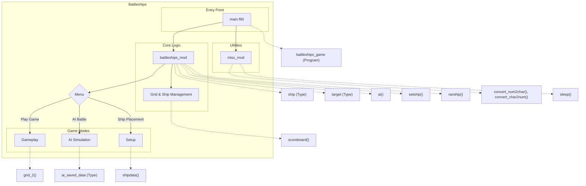

# Battleships

A text-based implementation of the classic Battleships game written in Fortran. This program allows players to engage in strategic naval combat against an intelligent AI opponent. Players can place their fleet on a 10x10 grid and take turns firing at the opponent's ships, with the goal of sinking all enemy vessels before losing their own fleet.

## Key Features

- **Interactive Gameplay**: Place ships manually or use random placement, then engage in turn-based combat
- **Visual Grid Display**: Clear text-based visualization of both offensive and defensive grids
- **Intelligent AI**: Computer opponent with strategic targeting algorithms that adapt during gameplay
- **Multiple Game Modes**: Play against the AI or watch two AI opponents battle each other
- **Ship Management**: Five different ships with varying lengths following classic Battleships rules
- **Score Tracking**: Records hits, misses, and sunk ships for both players
- **ASCII Art Interface**: Includes game logo and intuitive grid layouts with coordinate systems
- **Configuration Options**: Adjustable game settings including battle speed

# Layout and Architecture
```
└── darius
    ├── c3-dariuszucker-darius-470889e    # Main project version with complete implementation
    │   ├── CMakeLists.txt                # Build configuration
    │   ├── LICENSE
    │   ├── README.md                     # Project documentation
    │   ├── battleships.f90               # Core module with game logic, ship management, AI
    │   ├── main.f90                      # Main program with game loop and user interface
    │   ├── misc.f90                      # Utility module with helper functions
    │   └── sleep.c                       # C implementation for timing delays
    │
    └── c3-dariuszucker-darius-ee4ee60    # Alternative/older project version
        ├── CMakeLists.txt
        ├── LICENSE
        ├── README.md
        ├── battleships.f90
        ├── main.f90
        ├── misc.f90
        └── sleep.c
```



# Usage Examples

## Installation

### Build with CMake

```sh
# Create build directory and configure project
cmake -B build
# Build the project
cmake --build build
```

### Build with Fortran Package Manager (FPM)

```sh
# Build and run with FPM
fpm run
```

## Game Basics

### Running the Game

```sh
# After building with CMake
build/battleships

# Or with FPM
fpm run
```

### Game Menu Navigation

The game presents a main menu with options:
1. Place your ships
2. Begin battle!
3. Watch an automated battle
4. About

Select options by entering the corresponding number.

## Ship Placement

### Manual Ship Placement

```
# In the Ship Placement Menu (Option 1 from the Main Menu):
# Example placing a Destroyer at position A1 facing North:
2       # Select Destroyer from the menu
A1      # Enter the bow coordinates (x,y)
N       # Enter direction (N,E,S,W)
```

### Auto Ship Placement

```
# In the Ship Placement Menu:
7       # Select "Auto assign"
Y       # Confirm auto assignment
```

### Valid Ship Directions

Ships can be placed in four directions:
- N: North (ship extends downward)
- E: East (ship extends left)
- S: South (ship extends upward)
- W: West (ship extends right)

## Gameplay

### Targeting Enemy Ships

```
# During your turn in battle:
A5      # Enter target coordinates (A-J for columns, 1-10 for rows)
```

### Watching an AI Battle

```
# From the main menu:
3       # Select "Watch an automated battle"
Y       # Confirm to clear current ship arrangement and watch AI battle
```

## Configuration

### Configuration File Format

The game uses a configuration file (config.dat) with the following format:

```
[seed]
operation=save
bank=0
```

## API Usage Examples

### Ship Type Initialization

```fortran
! Define ships with symbols, length, and initial state
TYPE(ship), DIMENSION(1:5) :: myShips
myShips(1)%nu = 'D'; myShips(1)%nl = 'd'; myShips(1)%l = 2  ! Destroyer
myShips(2)%nu = 'C'; myShips(2)%nl = 'c'; myShips(2)%l = 3  ! Cruiser
myShips(3)%nu = 'S'; myShips(3)%nl = 's'; myShips(3)%l = 3  ! Submarine
myShips(4)%nu = 'B'; myShips(4)%nl = 'b'; myShips(4)%l = 4  ! Battleship
myShips(5)%nu = 'A'; myShips(5)%nl = 'a'; myShips(5)%l = 5  ! Aircraft Carrier
myShips(1:5)%s = CB; myShips(1:5)%x = 0; myShips(1:5)%y = 0; myShips(1:5)%z = CN; myShips(1:5)%h = 0
```

### Grid Display

```fortran
! Display a single player grid (defense)
CHARACTER(LEN=2), DIMENSION(1:10,1:10) :: defence = CB//CB
CALL grid_1(defence, 'd')

! Display two grids side by side (defense and offense)
CHARACTER(LEN=2), DIMENSION(1:10,1:10) :: defence = CB//CB
CHARACTER(LEN=1), DIMENSION(1:10,1:10) :: offence = CB
CALL grid_2(defence, offence)
```

### Ship Placement

```fortran
! Place a ship on the grid
TYPE(ship) :: myShip
CHARACTER(LEN=2), DIMENSION(1:10,1:10) :: grid = CB//CB
myShip%x = 5; myShip%y = 5; myShip%z = 'N'; myShip%l = 3
myShip%nu = 'C'; myShip%nl = 'c'; myShip%s = CB
CALL setship(myShip, grid)

! Remove a ship from the grid
CALL clearship(myShip, grid)

! Random ship placement
TYPE(ship), DIMENSION(1:5) :: myShips
CHARACTER(LEN=2), DIMENSION(1:10,1:10) :: grid = CB//CB
CALL ranship(myShips, grid)
```

### AI Implementation

```fortran
! Initialize AI data structure
TYPE(ai_saved_data) :: ai_data
ai_data%first_time = .TRUE.

! Use AI to target player ships
LOGICAL, DIMENSION(1:5) :: playerShipsSunk = .FALSE.
TYPE(scoreboard_entity), DIMENSION(1:2) :: hits
TYPE(ship), DIMENSION(1:5) :: playerShips
CHARACTER(LEN=2), DIMENSION(1:10,1:10) :: playerGrid
TYPE(scoreboard_entity), DIMENSION(1:5) :: health
LOGICAL :: delayEnabled = .TRUE.
CALL ai(playerGrid, playerShips, playerShipsSunk, hits, 2, delayEnabled, ai_data, health)
```

### Utility Functions

```fortran
! Convert between grid coordinates and numbers
CHARACTER(LEN=1) :: col
INTEGER :: colNum
CALL convert_char2num('C', colNum)  ! Converts 'C' to 3
CALL convert_num2char(3, col)       ! Converts 3 to 'C'

! Convert a character number to integer
CHARACTER(LEN=2) :: charNum = "5 "
INTEGER :: rowNum
CALL convert_charnum2num(charNum, rowNum)  ! Converts "5 " to 5

! Display a target position
INTEGER :: x = 3, y = 5
CALL display_target(x, y)  ! Shows "Target: C5"

! Add a delay in milliseconds
CALL sleep(500)  ! Pauses for 500 milliseconds
```

# Key Feature Implementation Deep Dive: Battleships

## Overview

The Battleships game is a classic implementation of the naval combat board game written in Fortran. It features a robust structure with a core module (`battleships_mod`), a main program (`battleships_game`), and a utility module (`misc_mod`). The game supports both player vs. AI and AI vs. AI gameplay modes.

This deep dive focuses on three critical features that form the backbone of the game:

1. Ship Placement and Grid Management
2. AI Opponent Implementation
3. Game State Management

## 1. Ship Placement and Grid Management

### Implementation Details

The ship placement system is one of the core elements of the game, allowing both manual and automatic positioning of ships on the game grid.

#### Data Structures

Ships are represented by the `ship` derived type:

```fortran
TYPE ship
  INTEGER :: x, y, l, h
  ! x, y = coordinates of bow, l = length of ship, h = number of hits
  CHARACTER (LEN=1) :: z, nu, nl, s
  ! z = direction [N,E,S,W], nu = uppercase identifier, nl = lowercase identifier, s = state
  CHARACTER (LEN=16) :: n  ! ship name
END TYPE ship
```

The game board is represented as a 2D character array with two characters per cell:
- The first character indicates ship presence (ship identifier or blank)
- The second character indicates hit status (blank, miss marker, or hit marker)

#### Key Functions

##### `shipdata` Subroutine
This subroutine handles the user input for ship placement:
1. Takes user input for coordinates (e.g., "A1") and direction (N,E,S,W)
2. Validates placement by checking grid boundaries and collisions
3. Returns error codes that the main program uses to inform the user

##### `setship` and `clearship` Subroutines
These complementary routines handle the actual placement and removal of ships on the grid:

```fortran
SUBROUTINE setship(boat, array)
  ! Sets ship on grid, placing the head and body based on direction
  array(boat%x, boat%y) = boat%nu // boat%s  ! Place ship head
  
  SELECT CASE (boat%z)  ! Handle different directions
    CASE ('N')
      DO i=1,boat%l-1
        array(boat%x,boat%y+i) = boat%nl // boat%s  ! Place ship body
      END DO
    ! [Other directions handled similarly]
  END SELECT
END SUBROUTINE
```

##### `ranship` Subroutine
For automatic ship placement, the `ranship` subroutine uses a clever algorithm that:
1. Sorts ships by descending length (longer ships placed first for better fit)
2. Randomizes position and orientation 
3. Validates placement via `checkship_grid` and `checkship_collision`
4. Repeats until valid placements are found for all ships

### Integration with Game Flow

In the main program, the ship placement feature is integrated through:
1. A dedicated menu option for ship placement
2. Option to manually place each ship or auto-assign all ships
3. Error handling for invalid placements
4. Verification that all ships are placed before battle can begin

The implementation ensures ships are properly represented visually with different characters for the bow (uppercase) and body (lowercase), making the grid intuitive to read.

## 2. AI Opponent Implementation

### Implementation Details

The AI opponent is one of the most sophisticated parts of the codebase, implementing a multi-stage targeting strategy that mimics human gameplay patterns.

#### Data Structure

The AI's state is tracked using the `ai_saved_data` type:

```fortran
TYPE ai_saved_data
  INTEGER :: stage, scan_stage, pass, start, clock, pos, line_pos
  INTEGER, DIMENSION(1:2) :: centre, try
  INTEGER, DIMENSION(1:4,1:2) :: adjacent
  INTEGER, DIMENSION(-4:4,1:2) :: line
  LOGICAL :: first_time = .TRUE.
END TYPE
```

This structure stores the AI's current targeting strategy, previous hits, and firing patterns.

#### AI Logic Stages

The AI operates in three main stages, implemented in the `ai` subroutine:

1. **Random Targeting (Stage 1)**:
   - The AI randomly selects coordinates to fire at
   - If a hit occurs, records position and moves to Stage 2
   - If a ship is sunk, returns to Stage 1

2. **Adjacent Targeting (Stage 2)**:
   - After a hit, the AI targets adjacent positions (N,E,S,W)
   - Uses a calculated approach to try positions in a systematic pattern
   - If another hit occurs, moves to Stage 3
   - If all adjacent positions miss or are invalid, returns to Stage 1

3. **Line Targeting (Stage 3)**:
   - Once direction is determined (two hits in a row), the AI fires along that line
   - Continues until it either misses or sinks the ship
   - Uses a sophisticated line calculation system to track valid firing positions

#### Sample Code Excerpt (Adjacent Targeting Logic):

```fortran
! Calculate adjacent positions to the first hit
ai_data%adjacent(1,1) = ai_data%centre(1)     ; ai_data%adjacent(1,2) = ai_data%centre(2) - 1 ! north
ai_data%adjacent(2,1) = ai_data%centre(1) + 1 ; ai_data%adjacent(2,2) = ai_data%centre(2)     ! east
ai_data%adjacent(3,1) = ai_data%centre(1)     ; ai_data%adjacent(3,2) = ai_data%centre(2) + 1 ! south
ai_data%adjacent(4,1) = ai_data%centre(1) - 1 ; ai_data%adjacent(4,2) = ai_data%centre(2)     ! west

! Validate positions (check if on grid)
DO i=1,4
  IF(ai_data%adjacent(i,1) >= 1 .AND. ai_data%adjacent(i,1) <= 10 .AND. &
     ai_data%adjacent(i,2) >= 1 .AND. ai_data%adjacent(i,2) <= 10) CYCLE
  ai_data%adjacent(i,1:2) = -1 ! points off the grid will be ignored
END DO

! Check if already fired at position
DO i=1,4
  IF(ai_data%adjacent(i,1) /= -1) THEN
    p0t%x = ai_data%adjacent(i,1); p0t%y = ai_data%adjacent(i,2)
    p0t%s = defence(p0t%x, p0t%y)
    IF(p0t%s(2:2) /= CB) ai_data%adjacent(i,1:2) = -2 ! already fired
  END IF
END DO
```

### Integration with Game Flow

The AI is integrated into the game through:
1. The main game loop that alternates between player and AI turns
2. Support for automated battles (AI vs. AI)
3. A configurable delay parameter to control AI "thinking" time
4. Visual feedback of AI targeting through the game grid

The AI design creates a challenging opponent that uses a hunting strategy similar to human players rather than purely random targeting.

## 3. Game State Management

### Implementation Details

The game state management system tracks the progress of the game, including ship health, hit/miss tracking, and win conditions.

#### Core Components

1. **Game Boards**:
   - `defence`: Player's ship positions and opponent hits
   - `offence`: Player's targeting grid (hits and misses)
   - `comp`: Computer's ship positions and player hits

2. **State Tracking**:
   - `p1sunk` and `p2sunk`: Boolean arrays tracking which ships are sunk
   - `hits`: Scoreboard entities tracking hit counts
   - `health`: Scoreboard showing current ship health status

#### Key Functions

##### `identify` Subroutine
This critical function processes hits to determine which ship was hit and if it was sunk:

```fortran
SUBROUTINE identify(t, boats, i, s)
  ! t = target with hit info, boats = ships array
  ! i = output index of hit ship, s = output sunk status
  
  ! Convert ship identifier to uppercase
  t%s(1:1) = toUpper(t%s(1:1))
  
  ! Determine which ship was hit based on identifier
  SELECT CASE (t%s(1:1))
    CASE ('D')
      i = 1
    CASE ('C')
      i = 2
    ! [Other cases]
  END SELECT
  
  ! Update hit count and check if sunk
  boats(i)%h = boats(i)%h + 1
  s = (boats(i)%h == boats(i)%l)  ! Ship is sunk when hits equal length
END SUBROUTINE
```

##### `scoreboard` Subroutine
Displays the current game state including scores and health:

```fortran
SUBROUTINE scoreboard(title, entities)
  CHARACTER(LEN=*), INTENT(IN) :: title
  TYPE(scoreboard_entity), DIMENSION(:), INTENT(IN) :: entities
  
  print '(/,3x,a)', TRIM(title)
  DO i=1,SIZE(entities)
    WRITE(stdout,"(4x,2a,i0,a,i0)") TRIM(entities(i)%n),' : ',entities(i)%s,' / ',entities(i)%t
  END DO
END SUBROUTINE
```

##### Grid Display Subroutines
The `grid_1` and `grid_2` subroutines render the current game state visually:
- `grid_1`: Shows a single grid (defense, offense, or computer)
- `grid_2`: Shows two grids side by side (typically defense and offense)

### Integration with Game Flow

In the main program, game state is managed through:

1. Initialization of all game state variables at the start
2. Updating state after each player and AI move
3. Visual display of current state after each round
4. Win condition checks after each turn
5. Final game outcome determination based on ship status

The main game loop ties everything together:
```fortran
DO ! round loop
  ! Player 1's turn
  [Player or AI targeting logic]
  
  ! Check for win condition
  IF(ALL(p2sunk)) THEN
    print '(a)', "You've sunk all my ships!"
  END IF
  
  ! Player 2's turn
  CALL ai(defence, player1, p1sunk, hits, 2, delay, ai2, health)
  
  ! Check for win condition
  IF(ALL(p1sunk)) THEN
    print '(a)', "I've sunk all your ships!"
  END IF
  
  ! Display updated game state
  CALL grid_2(defence, offence)
  CALL scoreboard(hits_title, hits)
  CALL scoreboard(health_title, health)
  
  ! Determine game outcome
  IF(ALL(p2sunk) .AND. ALL(p1sunk)) THEN
    print '(a)', "It's a draw!"
  ELSEIF(ALL(p2sunk)) THEN
    print '(a)', 'You win!'
  ELSEIF(ALL(p1sunk)) THEN
    print '(a)', 'You lose!'
  END IF
  
  ! Exit if game over
  IF(ALL(p2sunk) .OR. ALL(p1sunk)) EXIT
  
  r = r + 1  ! Increment round counter
END DO
```

## Conclusion

The Battleships implementation showcases solid game design principles with clear separation of concerns between:
- Core game logic in the battleships module
- Main program flow and user interaction
- Utility functions for common operations

The AI implementation is particularly noteworthy, featuring a sophisticated multi-stage targeting strategy that makes for a challenging opponent. The ship placement and game state management systems provide a solid foundation that could be extended with additional features like networked multiplayer, different board sizes, or custom ship configurations.

For developers looking to enhance the game, these key systems provide clear extension points. For example, the AI could be further improved with difficulty levels, the ship placement could support custom ship types, and the game state could be extended to support saving/loading games.

# Implemented User Stories

## Game Setup
- [ ] As a player, I want to see the Battleships game logo, so that I know what game I'm playing.
- [ ] As a player, I want to navigate a main menu with options for ship placement, battle, automated battle, and information, so that I can choose what to do.
- [ ] As a player, I want to place ships manually on the grid, so that I can create a strategic ship layout.
- [ ] As a player, I want to have ships automatically placed on the grid, so that I can start playing quickly.
- [ ] As a player, I want to place ships in different orientations (North, East, South, West), so that I can create varied ship layouts.
- [ ] As a player, I want feedback on invalid ship placements (off-grid or overlapping), so that I can correct my mistakes.

## Gameplay
- [ ] As a player, I want to see my defense grid (my ships) and offense grid (my shots), so that I can track the game state.
- [ ] As a player, I want to select coordinates to fire at the opponent's ships, so that I can try to sink them.
- [ ] As a player, I want feedback on whether my shots hit or miss, so that I can adjust my strategy.
- [ ] As a player, I want to know when I've sunk an opponent's ship, so that I can track my progress.
- [ ] As a player, I want to see a health scoreboard for my ships, so that I know which ships are damaged or sunk.
- [ ] As a player, I want to see the current score, so that I know how I'm performing against the opponent.
- [ ] As a player, I want to be notified when all my ships or the opponent's ships are sunk, so that I know when the game ends.
- [ ] As a player, I want to know if I've won, lost, or drawn the game, so that I have closure on the match outcome.

## AI Opponent
- [ ] As a player, I want to play against an AI opponent, so that I can enjoy the game without a human opponent.
- [ ] As a player, I want the AI to make strategic moves rather than just random shots, so that the game is challenging.
- [ ] As a player, I want the AI to hunt for my ships after getting a hit, so that the game feels realistic.

## Spectator Mode
- [ ] As a spectator, I want to watch an automated battle between two AI players, so that I can enjoy the game without participating.
- [ ] As a spectator, I want to see the progress of an automated battle with hits, misses and sunk ships, so that I can follow the game flow.

## Help & Information
- [ ] As a player, I want access to help information about ship placement, so that I understand how to position my fleet.
- [ ] As a player, I want to view information about the game, including credits and references, so that I can learn about its development.

## Configuration
- [ ] As a player, I want the game to save and load configuration settings, so that my preferences are remembered between sessions.
- [ ] As a player, I want visual feedback with appropriate timing delays between actions, so that I can follow the game flow.