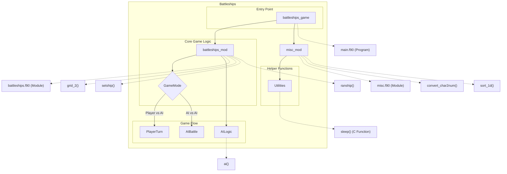

# Battleships Game

This repository contains a classic implementation of the Battleships game in Fortran 90, featuring both player vs. AI and AI vs. AI game modes. The game provides a complete console-based battleships experience with ASCII graphics, ship placement mechanics, and an intelligent AI opponent that uses a progressive strategy for hunting down player ships.

## Key Features

- Complete Battleships game with traditional rules and gameplay
- Player vs. Computer and Computer vs. Computer game modes
- ASCII art interface with dual grid display (defense and offense views)
- Strategic AI opponent that evolves its targeting approach:
  - Random firing to locate initial targets
  - Adjacent targeting to determine ship orientation
  - Line firing to efficiently sink identified vessels
- Manual or automatic (random) ship placement options
- Five standard ship types (Destroyer, Cruiser, Submarine, Battleship, Aircraft Carrier)
- Scoreboard system to track hits and ships remaining
- Clean, modular code organization with comprehensive type definitions

# Layout and Architecture
```
└── darius/
    ├── c3-dariuszucker-darius-470889e/  # Latest version of the Battleships game
    │   ├── battleships.f90  # Core game module with ship, grid and AI logic
    │   ├── main.f90         # Main program with game loop and player interactions
    │   ├── misc.f90         # Utility functions for string/number conversions
    │   ├── sleep.c          # C implementation of sleep function
    │   ├── CMakeLists.txt   # Build configuration
    │   ├── fpm.toml         # Fortran package manager config
    │   └── README.md        # Documentation
    │
    └── c3-dariuszucker-darius-ee4ee60/  # Earlier version of the Battleships game
        ├── battleships.f90
        ├── main.f90
        ├── misc.f90
        ├── sleep.c
        ├── CMakeLists.txt
        ├── fpm.toml
        └── README.md
```



# Usage Examples

## Build and Installation

### Using CMake

```bash
# Create a build directory and configure the project
cmake -B build
cmake --build build

# Run the game
build/battleships
```

### Using Fortran Package Manager (FPM)

```bash
# Build and run using FPM
fpm run
```

### Installation (Optional)

```bash
# Install the executable system-wide (requires admin privileges)
cmake --install build
```

## Game Mechanics

### Starting a New Game

```bash
# Run the game executable
./battleships

# From the main menu, choose option 1 to place ships, 
# then option 2 to begin battle
```

### Ship Placement

#### Manual Ship Placement

```bash
# Select option 1 from the main menu
# Then select options 2-6 to place individual ships
# For example, to place a Destroyer:
# 1. Select option 2
# 2. Enter coordinates for bow (e.g., "A1")
# 3. Enter direction for ship (N, E, S, W)
```

#### Random Ship Placement

```bash
# Select option 1 from the main menu
# Then select option 7 for automatic ship placement
# Confirm with "Y" when prompted
```

### Gameplay - Targeting

```bash
# During battle, enter coordinates to fire at
# Format: letter+number (e.g., "A1", "B10")
# Game shows hits/misses and tracks ship status
```

### AI vs. AI Battle

```bash
# Select option 3 from the main menu
# Confirm with "Y" when prompted
# Watch the automated battle between two AI players
```

## API Usage Examples

### Grid Display Functions

```fortran
! Display a player's defensive grid (shows own ships)
call grid_1(player_grid, 'd')

! Display a player's offensive grid (tracking shots on opponent)
call grid_1(player_grid, 'o')

! Display both grids side by side (defense and offense)
call grid_2(defense_grid, offense_grid)
```

### Ship Manipulation

```fortran
! Place a ship on the grid
call setship(my_ship, my_grid)

! Remove a ship from the grid
call clearship(my_ship, my_grid)

! Get user input for ship placement
call shipdata(my_ship, my_grid, error_grid, error_collision)

! Place ships randomly on the grid
call ranship(my_ships, my_grid)
```

### AI Opponent

```fortran
! Initialize AI data structure
type(ai_saved_data) :: ai_data

! Let AI make a move against player's grid
call ai(player_defense, player_ships, player_ships_sunk, hits, 2, delay, ai_data, health)

! AI vs AI battle move
call ai(comp, player2, p2sunk, hits, 1, delay, ai1, offence=offence)
```

### Scoring and Display

```fortran
! Display game score information
call scoreboard("Score", hits)

! Display the game logo
call logo()

! Show which ship was hit and if it was sunk
call identify(target, ships, hit_ship, sunk)
```

### Utility Functions

```fortran
! Convert numeric coordinates to character (1 → A, 2 → B, etc.)
call convert_num2char(1, character_result)  ! character_result becomes 'A'

! Convert character coordinates to numeric (A → 1, B → 2, etc.)
call convert_char2num('A', numeric_result)  ! numeric_result becomes 1

! Convert character numeral to integer ('1' → 1, '10' → 10)
call convert_charnum2num('10', numeric_result)  ! numeric_result becomes 10

! Sort a 1D integer array (ascending or descending)
call sort_1d(int_array, 'a')  ! ascending sort
call sort_1d(int_array, 'd')  ! descending sort
```

# Key Feature Implementation Deep Dive: Battleships in Fortran

This deep dive explores the core functionality of a Battleships game implemented in Fortran 2008. After analyzing the codebase, I've identified three key features that are central to the game's operation: the Ship Placement System, AI Opponent Logic, and Grid Rendering System.

## 1. AI Opponent Logic

The AI opponent is one of the most sophisticated aspects of the codebase, implementing a three-stage targeting strategy similar to how a human would play the game.

### Implementation Overview

The AI logic is implemented in the `ai` subroutine within the `battleships_mod` module. This complex subroutine (over 400 lines) uses a state machine approach with three distinct stages of targeting behavior:

1. **Random Search (Stage 1)**: Finding initial targets
2. **Adjacent Search (Stage 2)**: After a hit, exploring adjacent spaces
3. **Line Targeting (Stage 3)**: Once ship orientation is determined, firing along that line

### Key Data Structures

The AI maintains its state in an `ai_saved_data` type, which includes:

```fortran
TYPE ai_saved_data
  INTEGER :: stage, pass, scan_stage, start, clock, pos, line_pos
  INTEGER, DIMENSION(1:2) :: centre, try
  INTEGER, DIMENSION(1:4,1:2) :: adjacent
  INTEGER, DIMENSION(-4:4,1:2) :: line
  LOGICAL :: first_time = .TRUE.
END TYPE ai_saved_data
```

This structure stores:
- The current targeting stage and sub-stage
- The position of confirmed hits
- Data for adjacent targeting squares
- Line coordinates once ship orientation is known

### Stage-Based Targeting Algorithm

1. **Stage 1 (Random Targeting)**
   - Randomly selects coordinates where it hasn't fired before
   - If it's a hit, records the position and advances to Stage 2
   - If it's a miss, stays in Stage 1

```fortran
! Random targeting code snippet
DO
  CALL RANDOM_NUMBER(random); random = random*10.0 + 1.0
  p0t%x = INT(random(1)); p0t%y = INT(random(2))
  p0t%s = defence(p0t%x, p0t%y)
  IF(p0t%s(2:2) == CB) EXIT ! not already fired at this position
END DO
```

2. **Stage 2 (Adjacent Targeting)**
   - After a hit, creates an array of the four adjacent squares (N,E,S,W)
   - Tests these squares in a random order
   - If a square is invalid (off grid or already fired at), it's marked and skipped
   - If a second hit is made, determines likely ship orientation and moves to Stage 3

```fortran
! Adjacent targeting calculation
ai_data%adjacent(1,1) = ai_data%centre(1); ai_data%adjacent(1,2) = ai_data%centre(2) - 1 ! north
ai_data%adjacent(2,1) = ai_data%centre(1) + 1; ai_data%adjacent(2,2) = ai_data%centre(2) ! east
ai_data%adjacent(3,1) = ai_data%centre(1); ai_data%adjacent(3,2) = ai_data%centre(2) + 1 ! south
ai_data%adjacent(4,1) = ai_data%centre(1) - 1; ai_data%adjacent(4,2) = ai_data%centre(2) ! west
```

3. **Stage 3 (Line Targeting)**
   - Once ship orientation is determined, creates a line array in that direction
   - Fires along this line until the ship is sunk or encounters a miss
   - Uses "about-face" logic to switch directions if it reaches the end without sinking the ship

```fortran
! Line targeting logic (condensed)
ai_data%line(0,1:2) = ai_data%centre
SELECT CASE(ai_data%pos)
  CASE (1) ! north
    ai_data%line(-4:4,1) = ai_data%centre(1) ! same x value
    DO i=-4,4
      ai_data%line(i,2) = ai_data%centre(2) - i ! different y values
    END DO
  ! Similar cases for other directions
END SELECT
```

### Integration with Game Loop

In the main game loop, the AI is invoked on Player 2's turn:

```fortran
CALL ai(defence, player1, p1sunk, hits, 2, delay, ai2, health)
```

This passes the player's grid, ships, ship status, and scoring information to the AI, which then determines its next move.

## 2. Ship Placement System

The ship placement system allows both manual user placement and automatic random placement of ships on the game grid.

### Implementation Overview

Ship placement is handled through several interconnected subroutines:

- `shipdata` - Gets and validates user input for ship placement
- `setship` - Places a ship on the grid
- `clearship` - Removes a ship from the grid
- `ranship` - Randomly places ships
- `checkship_grid` and `checkship_collision` - Validation subroutines

### Ship Representation

Ships are represented by a custom `ship` type:

```fortran
TYPE ship
  INTEGER :: x, y, l, h
  CHARACTER(LEN=1) :: z, nu, nl, s
  CHARACTER(LEN=16) :: n
END TYPE ship
```

This stores:
- Position coordinates (`x,y`)
- Length and hits (`l,h`)
- Direction (`z`): N, E, S, W
- Characters for display (`nu,nl,s`)
- Name (`n`)

### Manual Ship Placement

The manual placement system uses the `shipdata` subroutine, which:
1. Prompts the user for ship bow coordinates and direction
2. Validates the input format using character code checks
3. Calls validation subroutines to check grid boundaries and collisions
4. Returns error flags if placement is invalid

```fortran
DO
  write(stdout,'(a,1x)', ADVANCE='no') "<I> Enter x- and y- coordinates of ship's bow, from A1 to J10 [A-J 1-10]:"
  read(stdin,'(a3)', iostat=i) ans
  ! Input validation...
END DO
CALL convert_char2num(ans(1:1),boat%x)
CALL convert_charnum2num(ans(2:3),boat%y)
```

### Automatic Ship Placement

The automatic placement uses the `ranship` subroutine, which:
1. Sorts ships by length (largest first)
2. Attempts to place each ship with random coordinates and orientation
3. Validates each placement and retries if invalid
4. Continues until all ships are validly placed

```fortran
DO i=1,SIZE(lengths) ! Sort ships by length
  lengths(i) = boats(i)%l
END DO
CALL sort_1d(lengths,'d')

DO i=1,SIZE(lengths) ! Place each ship
  DO ! Try until valid placement found
    CALL RANDOM_NUMBER(ran)
    ran = ran*10.0 + 1.0
    ! Set random position and orientation
    CALL checkship_grid(boats(i),c1)
    CALL checkship_collision(boats(i),array,c2)
    IF(c1 == 0 .AND. c2 == 0) THEN
      CALL setship(boats(i),array)
      EXIT
    END IF
  END DO
END DO
```

### Grid Validation

Two key validation subroutines ensure ships stay within bounds and don't overlap:

1. `checkship_grid` - Verifies that a ship fits within the 10x10 grid
2. `checkship_collision` - Checks that a ship doesn't overlap with existing ships

```fortran
! Grid boundary checking (simplified)
SELECT CASE (boat%z)
  CASE ('N')
    DO i = 1, boat%l - 1
      IF(boat%y + i > 10) THEN
        c = c + 1
        EXIT
      END IF
    END DO
  ! Similar checks for other directions
END SELECT
```

## 3. Grid Rendering System

The game uses a sophisticated grid rendering system to display the game state to players.

### Implementation Overview

Grid rendering is handled by three main subroutines:
- `grid_1` - Displays a single grid (defense, offense, or computer)
- `grid_2` - Displays two grids side-by-side with compass directions
- `logo` - Displays the game's ASCII art title

### Grid Representation

The game uses character arrays to represent grids:
- `defence(10,10)` - Player's defensive grid (Character*2)
- `offence(10,10)` - Player's offensive grid (Character*1)
- `comp(10,10)` - Computer's grid (Character*2)

Each cell in the defensive grid contains two characters:
1. First character: Ship identifier (or blank)
2. Second character: Hit/miss marker or blank

```fortran
! Character constants used for grid display
CHARACTER, PARAMETER :: CH = '*', CM = '.', CB = ' ', CN = '0'
CHARACTER, PARAMETER :: GSV = '|', GSH = '=', GC = '+'
```

### Grid Rendering Functions

The `grid_2` subroutine displays both player and computer grids side-by-side:

```fortran
SUBROUTINE grid_2(a1,a2)
  CHARACTER (LEN=*), DIMENSION(:,:), INTENT(IN) :: a1, a2
  
  print '(15x,a,20x,a,13x,a)', 'DEFENCE','^','OFFENCE'
  print '(6x,11(a,2x),2x,a,7x,11(a,1x))', &
    &'A','B','C','D','E','F','G','H','I','J',GC//GC,'N','A','B','C','D','E','F','G','H','I','J','+'
  
  DO j=1,10
    write(stdout,'((3x,i2,1x))', ADVANCE='no') j
    ! Write defense grid cells
    DO i=1,10
      write(stdout,'(a,1x)', ADVANCE='no') a1(i,j)
    END DO
    
    write(stdout,'(a)',ADVANCE='no') GSV//GSV
    
    ! Add compass directions for first few rows
    IF(key) THEN
      SELECT CASE (j)
        CASE (1)
          write(stdout,'(4(1x,a))', ADVANCE='no') '<','W','E','>'
          write(stdout,'((1x,i2,1x))', ADVANCE='no') j
        ! Additional cases...
      END SELECT
    END IF
    
    ! Write offense grid cells
    DO i=1,10
      write(stdout,'(a,1x)', ADVANCE='no') a2(i,j)
    END DO
    
    write(stdout,'(a)',ADVANCE='no') GSV
    write(stdout,*)
  END DO
  
  ! Draw bottom border
  write(stdout,'(3x,a,1x)',ADVANCE='no') GC//GC
  DO i=1,10
    write(stdout,'(a,1x)',ADVANCE='no') GSH//GSH
  END DO
  ! Rest of border drawing...
END SUBROUTINE grid_2
```

This produces a visually appealing display like:

```
                DEFENCE                    ^               OFFENCE
    ++ A  B  C  D  E  F  G  H  I  J  ++    N       A B C D E F G H I J +
     1 -- -- -- -- -- -- -- -- -- -- || < W E >  1 - - - - - - - - - - |
     2 -- -- -- -- -- -- -- -- -- -- ||    S     2 - - - - - - - - - - |
     3 -- -- -- -- -- -- -- -- -- -- ||    v     3 - - - - - - - - - - |
```

### Integration with Game Loop

The grid rendering system is called at key moments in the game loop:
1. After initial ship placement to confirm positions
2. After each round to show updated game state
3. At the end of the game to display final positions

```fortran
write(stdout,"(a)", advance="no") CLEAR_SCREEN
write(stdout,*)
CALL grid_2(defence,offence)
CALL scoreboard(hits_title,hits)
CALL scoreboard(health_title,health)
```

## Conclusion

The Battleships game demonstrates sophisticated Fortran programming with its three key features:

1. The **AI Opponent** implementing a human-like targeting strategy through progressive stages
2. The **Ship Placement System** providing flexible manual and automatic placement options
3. The **Grid Rendering System** creating an intuitive visual interface for players

These components work together to create an engaging gameplay experience through a well-structured, modular design. Developers looking to enhance the game might consider adding network play capabilities, a graphical user interface, or more sophisticated AI strategies building on the existing state machine architecture.

# Implemented User Stories

## Game Setup and Configuration
- [ ] As a player, I want to start a new game, so that I can play Battleships.
- [ ] As a player, I want to see the game logo and menu, so that I can select different game options.
- [ ] As a player, I want to configure game settings, so that I can customize my experience.
- [ ] As a player, I want to read the game rules/help, so that I understand how to play.
- [ ] As a player, I want to view information about the game, so that I know who created it.
- [ ] As a player, I want the game to remember my configuration between sessions, so I don't have to set it up every time.

## Ship Placement
- [ ] As a player, I want to manually place my ships on the grid, so that I can strategically position my fleet.
- [ ] As a player, I want to specify the position and orientation of each ship, so that I can control my fleet layout.
- [ ] As a player, I want to get feedback when my ship placement is invalid (off grid or colliding), so that I can correct it.
- [ ] As a player, I want to automatically place my ships randomly, so that I can start playing quickly.
- [ ] As a player, I want to clear my current ship arrangement, so that I can start placement over.
- [ ] As a player, I want to see a visual representation of my fleet on the grid, so that I can confirm my ship placement.

## Gameplay
- [ ] As a player, I want to target coordinates on the opponent's grid, so that I can try to hit their ships.
- [ ] As a player, I want to see the result of my attacks (hit or miss), so that I can plan my next move.
- [ ] As a player, I want to see visual indicators for hits and misses on the grid, so that I can track my progress.
- [ ] As a player, I want to be notified when I've sunk an enemy ship, so that I know my progress in the game.
- [ ] As a player, I want to see which of my ships have been hit, so that I know their status.
- [ ] As a player, I want to see a scoreboard showing hits and remaining ships, so that I can track game progress.
- [ ] As a player, I want to know when the game ends (win/lose/draw), so that I know the outcome.
- [ ] As a player, I want to play against the computer AI, so that I can enjoy the game without a human opponent.

## AI Opponent
- [ ] As a player, I want the AI to have different difficulty levels or strategies, so that the game remains challenging.
- [ ] As a player, I want the AI to intelligently target my ships once it finds a hit, so the game feels realistic.
- [ ] As a player, I want the AI to follow proper game rules when placing ships and taking turns, so the game is fair.

## Spectator Mode
- [ ] As a spectator, I want to watch an AI vs AI automated battle, so that I can enjoy the game without participating.
- [ ] As a spectator, I want to see the progress and outcome of the automated battle, so I can follow the action.

## User Interface
- [ ] As a player, I want a clear visual grid representation, so that I can easily understand the game state.
- [ ] As a player, I want visual feedback on the grid showing my ships, hits, and misses, so that I can track the battle progress.
- [ ] As a player, I want to see a compass on the grid, so that I can easily understand ship orientations.
- [ ] As a player, I want the screen to refresh between turns, so that the game display remains clear and organized.

## Technical Requirements
- [ ] As a developer, I want the game to handle invalid user input gracefully, so that the game doesn't crash.
- [ ] As a developer, I want to use modern Fortran features, so that the code is compatible with current compilers.
- [ ] As a developer, I want the code organized into modules, so that it's maintainable and reusable.
- [ ] As a developer, I want to provide cross-platform compatibility, so users on different systems can play.